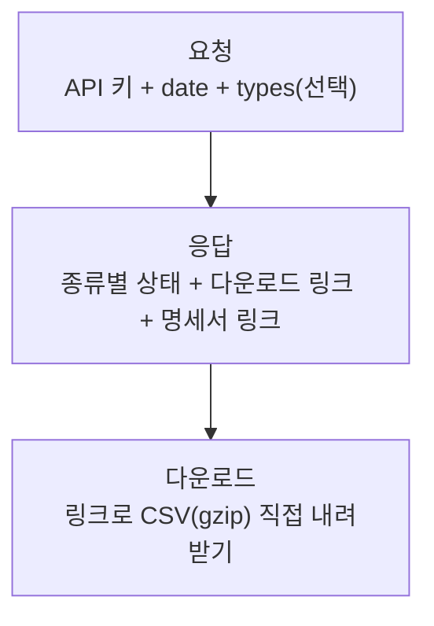

# 요청 및 응답 가이드

### 1. 데이터 종류

계약한 항목에 따라 아래 종류 중 이용 가능한 것이 정해집니다. 요청 시 종류를 지정하며, 생략하면 이용 중인 전체 종류가 대상이 됩니다.

종류별 컬럼 구성은 응답에 포함된 명세서 링크에서 확인할 수 있습니다.

<table><thead><tr><th width="142">종류(type)</th><th>내용</th></tr></thead><tbody><tr><td>site</td><td>사이트 방문·페이지 로그 (방문, 유입출처, 페이지 등)</td></tr><tr><td>commerce</td><td>커머스 구매·장바구니 행동 로그 (구매, 장바구니 담기/빼기, 네이버페이 구매 등)</td></tr><tr><td>refer</td><td>유입출처 집계 (검색·광고·외부도메인 등 유입 경로별 지표)</td></tr><tr><td>conversion</td><td>전환 로그 (주문완료·가입 등 전환 이벤트)</td></tr><tr><td>buy</td><td>구매 상세 로그 (구매 건·상품 단위 상세, 유입정보 포함)</td></tr></tbody></table>

### 2. 이용 흐름



#### 파일 요청

날짜와 데이터 종류를 지정해 API를 호출하면, 다운로드 링크(및 파일 상태)를 받습니다.



#### 파일 다운로드

받은 링크로 실제 CSV 파일을 내려받습니다.






전날 데이터는 매일 새벽에 생성되며, 오전 4시 이후 안정적으로 조회할 수 있습니다. 그 전에 요청하면 아직 생성 중일 수 있으며(status: pending), 이 경우 잠시 후 다시 요청하시면 됩니다.


### 3. API 레퍼런스

아래 스펙은 실제 계약·키 발급 후 안내되는 전용 엔드포인트를 기준으로 동작합니다. 예시의 `https://<발급받은-엔드포인트>` 부분은 발급 시 전달되는 실제 주소로 대체하세요.

#### 3.1 엔드포인트

```
GET https://<발급받은-엔드포인트>/v1/files
```

#### 3.2 인증

모든 요청은 HTTP 헤더에 API 키를 담아 보냅니다.

```
x-api-key: {발급받은_API_키}
```


키는 담당자를 통해 개별적으로 안전하게 전달됩니다. 키가 없거나 유효하지 않으면 401이 반환됩니다. 요청에는 계정 정보를 넣지 않습니다 — 키가 곧 계정이며, 키에 연결된 자사 데이터만 조회됩니다.


#### 3.3 요청 파라미터

<table><thead><tr><th width="99">파라미터</th><th width="82">필수</th><th width="302">설명</th><th>예시</th></tr></thead><tbody><tr><td>date</td><td>필수</td><td>조회할 날짜 (YYYYMMDD)</td><td>20260819</td></tr><tr><td>types</td><td>선택</td><td><p>데이터 종류. 쉼표로 여러 개 지정. </p><p>생략 시 이용 중인 전체 종류</p></td><td>conversion 또는 site,commerce</td></tr></tbody></table>


구독하지 않은 종류를 지정하면 응답에서 조용히 제외됩니다(에러 아님). types를 생략하면 구독 중인 모든 종류가 응답에 포함됩니다.


#### 3.4 응답 (200)

요청이 성공하면 종류별 상태와 다운로드 링크가 담긴 JSON을 반환합니다.

```json
{
  "date": "20260819",
  "files": [
    {
      "type": "conversion",
      "status": "done",
      "url": "https://... (다운로드 링크)",
      "expires_in": 600,
      "row_count": 1335
    }
  ],
  "schema": {
    "conversion": "https://... (컬럼 명세서 링크)"
  }
}
```

**응답 필드**

<table><thead><tr><th width="227">필드</th><th>설명</th></tr></thead><tbody><tr><td>date</td><td>요청한 날짜</td></tr><tr><td>files[].type</td><td>데이터 종류</td></tr><tr><td>files[].status</td><td>파일 상태 (아래 표 참고)</td></tr><tr><td>files[].url</td><td>다운로드 링크 (status가 done일 때만 제공)</td></tr><tr><td>files[].expires_in</td><td>다운로드 링크 유효시간(초). 기본 600초(10분)</td></tr><tr><td>files[].row_count</td><td>데이터 행 수</td></tr><tr><td>schema</td><td>종류별 컬럼 명세서(설명 파일) 다운로드 링크</td></tr></tbody></table>

**status 값**

| status   | 의미            | 권장 조치           |
| -------- | ------------- | --------------- |
| done     | 파일 준비 완료      | url로 다운로드       |
| pending  | 아직 생성되지 않음    | 잠시 후 다시 요청      |
| no\_data | 해당 날짜에 데이터 없음 | 정상 (해당일 데이터 없음) |
| failed   | 생성 실패         | 담당자 문의          |

#### 3.5 오류 응답

<table><thead><tr><th width="219">HTTP</th><th>의미</th></tr></thead><tbody><tr><td>401</td><td>API 키 누락 또는 유효하지 않음</td></tr><tr><td>400</td><td>필수 파라미터 누락 또는 형식 오류 (예: date 형식)</td></tr><tr><td>500</td><td>서버 내부 오류 (지속 시 담당자 문의)</td></tr></tbody></table>

### 4. 호출 예시

**4.1 파일 요청 (cURL)**

```bash
curl -H "x-api-key: {발급받은_API_키}" \
  "https://<발급받은-엔드포인트>/v1/files?date=20260819&types=conversion"
```

**4.2 파일 다운로드**

응답의 url 값으로 파일을 내려받습니다.


이 링크는 발급 후 10분간만 유효하므로 받은 즉시 다운로드하세요.


```bash
curl -o conversion_20260819.csv.gz "{응답으로 받은 url}"
gunzip conversion_20260819.csv.gz   # → conversion_20260819.csv
```

**4.3 전체 흐름 (요청 → 다운로드)**



#### 파일 요청

```
GET /v1/files?date=20260819&types=conversion  (+ x-api-key 헤더)
```



#### 응답 확인

files\[] 중 status == "done" 항목의 url을 확보합니다.



#### 파일 다운로드

해당 url로 10분 이내에 다운로드합니다.



#### 활용

gunzip 후 CSV 사용 (UTF-8 BOM).



### 5. 제약 및 정책

<table><thead><tr><th width="239">항목</th><th>내용</th></tr></thead><tbody><tr><td>제공 주기</td><td>매일 전날 데이터 준비 (오전 4시 이후 조회 가능)</td></tr><tr><td>보관 기간</td><td><p>생성일 기준 7일간 다운로드 가능. 이후 파일 삭제</p><p>(기간 경과 데이터는 담당자 문의)</p></td></tr><tr><td>다운로드 링크 유효시간</td><td>10분. 만료 시 다시 요청하면 새 링크 발급</td></tr><tr><td>데이터 범위</td><td>API 키에 연결된 자사 데이터만 조회</td></tr><tr><td>파일 형식</td><td>gzip 압축 CSV (UTF-8 BOM)</td></tr><tr><td>전송 보안</td><td>HTTPS(TLS) 통신, API 키 인증</td></tr></tbody></table>

### 부록. 자동화·연동을 구현하는 경우 <a href="#eb-b6-80-eb-a1-9d-ec-9e-90-eb-8f-99-ed-99-94-ec-97-b0-eb-8f-99-ec-9d-84-ea-b5-ac-ed-98-84-ed-95-98-e" id="eb-b6-80-eb-a1-9d-ec-9e-90-eb-8f-99-ed-99-94-ec-97-b0-eb-8f-99-ec-9d-84-ea-b5-ac-ed-98-84-ed-95-98-e"></a>

이 API로 클라이언트나 데이터 파이프라인을 구현할 때 참고할 사항입니다.

* **인증**: 모든 요청에 `x-api-key` 헤더가 필요합니다. 키는 환경변수 등 안전한 곳에 보관하고 코드·로그에 노출하지 마세요.
* **폴링**: status가 `pending`이면 아직 생성 전입니다. 즉시 재시도하기보다 간격을 두고(예: 수 분) 재요청하세요.
* **링크 만료**: url은 `expires_in`(기본 600초) 후 만료됩니다. 다운로드는 발급 직후 수행하고, 만료 시 파일 요청부터 다시 하세요. url을 장기 저장·재사용하지 마세요.
* **다건 처리**: types에 여러 종류를 넘기면 files\[]에 종류별로 담겨 옵니다. 각 항목의 status를 개별 확인하세요.
* **구독 필터**: 구독하지 않은 종류는 응답에서 제외되므로, 요청한 종류가 응답에 없을 수 있습니다(정상). 응답 기준으로 처리하세요.
* **인코딩**: CSV는 UTF-8 BOM입니다. 파서가 BOM을 처리하도록 설정하세요.
* **컬럼 정의**: 컬럼 구성은 schema 링크의 명세서를 기준으로 하세요. 컬럼은 종류별로 다릅니다.
* **오류 처리**: 401(키), 400(파라미터), 500(서버)을 구분해 처리하고, failed 상태는 재생성이 필요한 경우이므로 담당자 문의 대상입니다.
