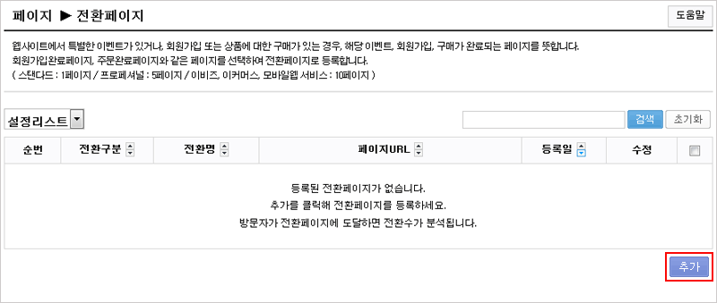
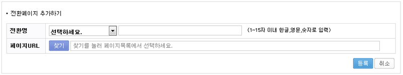
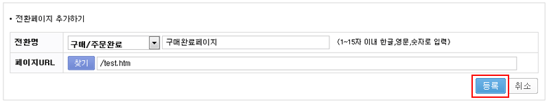
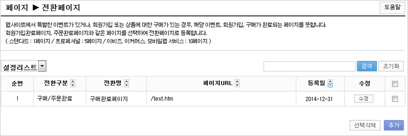
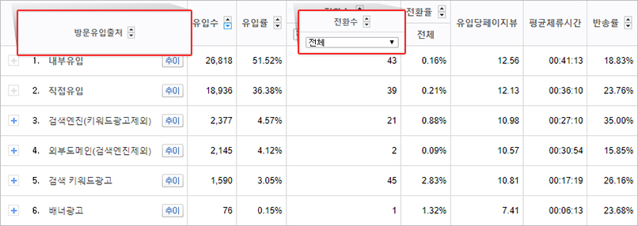
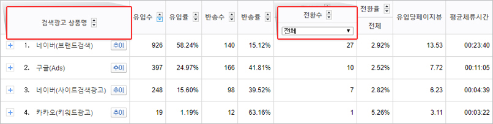
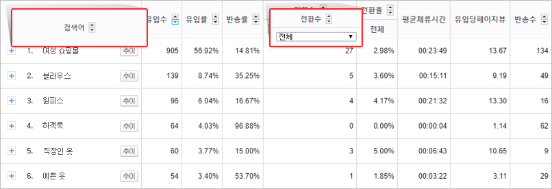
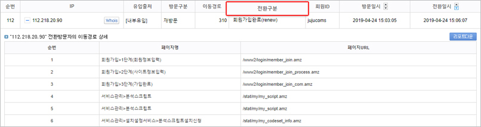

# 전환페이지 분석

전환페이지란 웹사이트의 특성과 목적에 맞게 정의하는 최종 도달 페이지입니다. 이벤트, 회원가입, 구매가 완료되는 페이지를 뜻하며, 목적에 맞게 전환페이지를 정의하고 측정하면 마케팅 효과를 더욱 효율적으로 파악할 수 있습니다.

### 1. 전환페이지 설정하기



#### 전환페이지 메뉴 열기

\[설정 > 페이지 > 전환페이지] 메뉴에서 우측 하단의 \[추가] 버튼을 클릭합니다.

<figure><figcaption></figcaption></figure>



#### 전환명과 페이지 URL 선택

* 전환명: 전환 구분(회원가입, 구매, 주문완료, 신청완료, 기타 등)을 선택한 후 전환명을 입력합니다. 입력한 전환명은 통계 리포트에 동일하게 표시됩니다.
* 페이지 URL: \[찾기]를 클릭해 페이지 목록에서 설정하려는 페이지를 선택합니다. 찾는 페이지가 없다면 해당 페이지에 분석 스크립트가 정상 설치되어 있는지 확인해 주세요.

<figure><figcaption></figcaption></figure>



#### 등록 및 확인

전환명과 페이지 URL 선택을 완료하면 \[등록]을 클릭합니다. 설정 리스트에 정상 등록되면 그 시점 이후부터 전환이 분석됩니다.

<figure><figcaption></figcaption></figure>

<figure><figcaption></figcaption></figure>




전화걸기 버튼이나 상담신청 완료 페이지처럼 별도의 완료 페이지가 없는 경우, 클릭 이벤트(링크 클릭) 분석을 설치하면 전환으로 분석할 수 있습니다.


### 2. 전환 분석 주요 리포트

| 리포트              | 설명                                                        |
| ---------------- | --------------------------------------------------------- |
| \[유입경로 > 방문유입출처] | 방문 유입 출처별 전환을 분석합니다. 전환율은 유입 대비 전환수의 비율이며, 높을수록 효율이 좋습니다. |

<figure><figcaption></figcaption></figure>

| 리포트                  | 설명                                      |
| -------------------- | --------------------------------------- |
| \[검색광고효과 > 검색광고 상품별] | 검색광고 상품별 전환을 분석해 광고 매체별 효율을 비교할 수 있습니다. |

<figure><figcaption></figcaption></figure>

| 리포트                   | 설명                                                                 |
| --------------------- | ------------------------------------------------------------------ |
| \[검색광고효과 > 검색광고 검색어별] | 키워드(검색어)별 전환을 분석합니다. 전환율이 낮은 키워드는 랜딩 페이지 적합성, 상품 구비 여부 등을 점검해 보세요. |

<figure><figcaption></figcaption></figure>

| 리포트               | 설명                                                             |
| ----------------- | -------------------------------------------------------------- |
| \[전환 > 전환 방문자 상세] | 전환에 도달한 방문자의 IP, 유입출처, 신규/재방문 여부, 이동경로, 방문·전환 일시 등을 상세히 보여줍니다. |

<figure><figcaption></figcaption></figure>

방문자의 편의를 고민하고 웹사이트를 개선하며 데이터를 분석하는 과정을 반복하면, 점차 높아지는 전환율을 확인할 수 있습니다.
