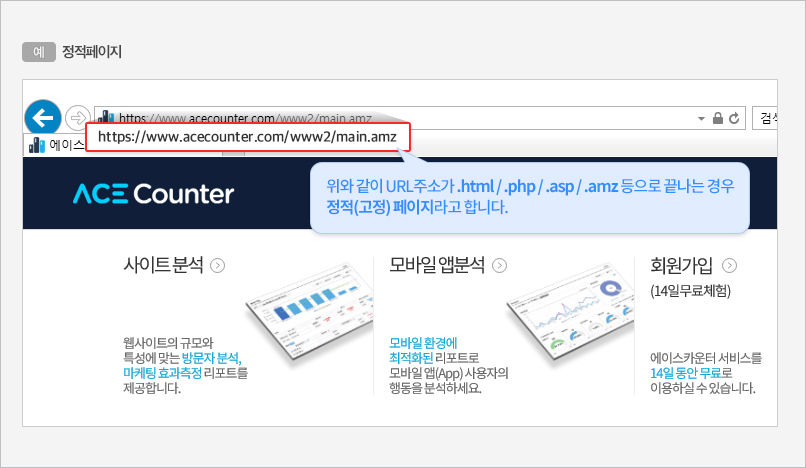
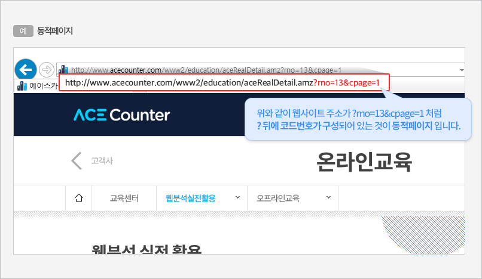
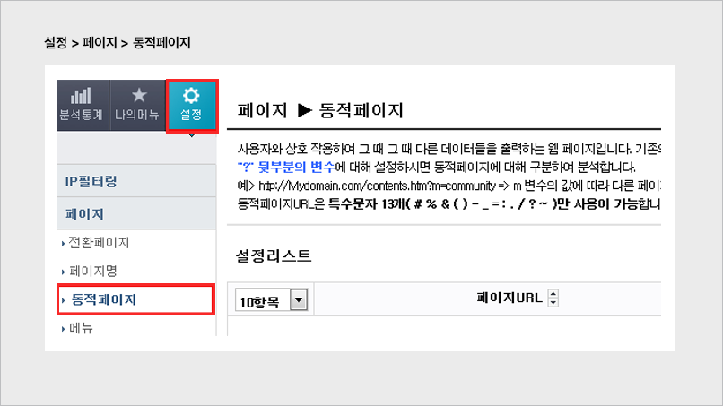
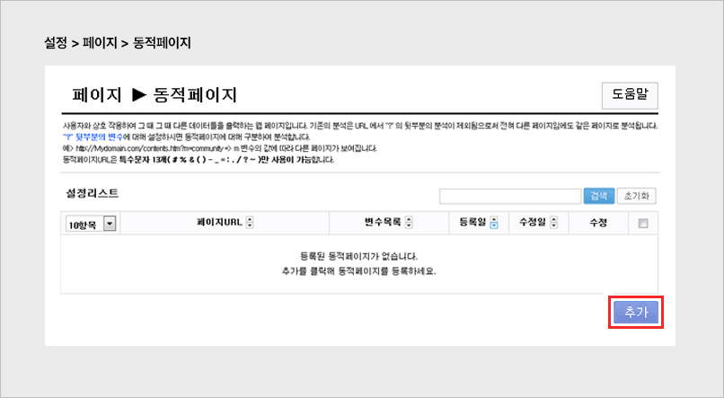
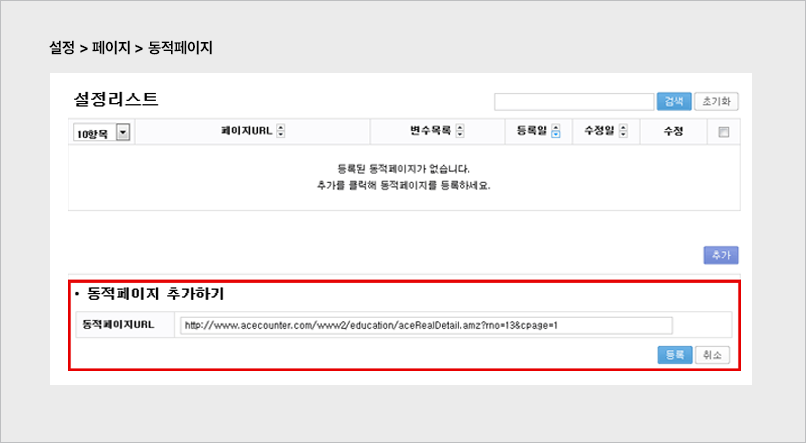
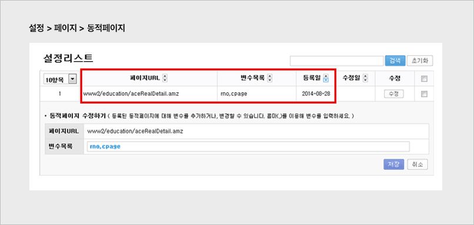

# 동적페이지 분석

### 1. 동적페이지 이해하기

**동적페이지란?** 페이지 URL이 고정된 정적페이지와 달리, 사용자와의 상호작용에 따라 그때그때 다른 데이터를 출력하는 페이지입니다. 페이지명은 같지만 뒤에 붙는 변수값에 따라 서로 다른 페이지가 표시됩니다.

**정적페이지란?** URL 주소가 `.html`, `.php`, `.asp`, `.amz` 등으로 끝나는 경우를 정적(고정)페이지라고 합니다.

<figure><figcaption></figcaption></figure>

**동적페이지 예시**: URL이 `?rno=13&cpage=1`처럼 `?` 뒤에 코드번호로 구성되어 있다면 동적페이지입니다. 즉, URL 중간에 `?`가 있는 경우 동적페이지로 볼 수 있습니다.

<figure><figcaption></figcaption></figure>


파라미터를 직접 노출하는 GET 방식은 동적페이지 설정으로 분석이 가능하지만, 정보를 노출하지 않는 POST 방식은 페이지를 구분해 분석하기 어려울 수 있습니다.


### 2. 동적페이지 설정하기



#### 메뉴 이동

좌측 상단의 \[설정 > 페이지 > 동적페이지]를 클릭합니다.

<figure><figcaption></figcaption></figure>



#### 추가 버튼 클릭

설정 리스트 우측 하단의 \[추가] 버튼을 클릭합니다.

<figure><figcaption></figcaption></figure>



#### 동적페이지 URL 등록

\[동적페이지 추가하기] 영역에서 설정하려는 동적페이지 URL을 붙여넣고 \[등록] 버튼을 클릭합니다.

예) `http://mydomain.com/contents.htm?m=community` → `m` 변수의 값에 따라 다른 페이지로 구분해 분석합니다.

<figure><figcaption></figcaption></figure>



#### 등록 확인 및 변수 관리

설정 리스트에 등록된 URL과 변수를 확인할 수 있으며, \[수정] 버튼으로 변수를 추가·수정할 수 있습니다. `&` 문자는 변수 구분자이며, 변수를 추가하려면 `&변수=값` 형식으로 입력합니다.

<figure><figcaption></figcaption></figure>


