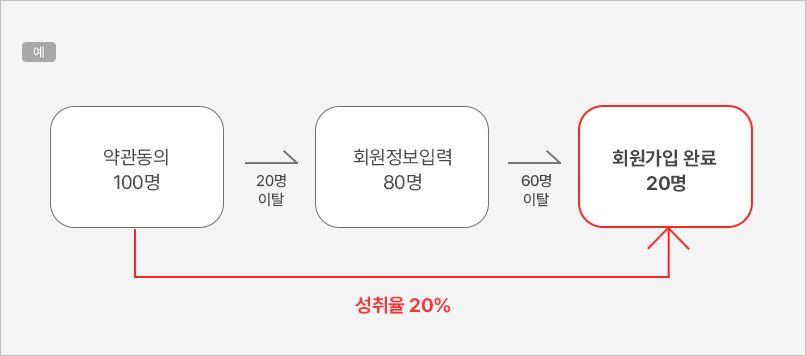
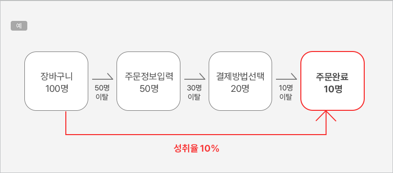
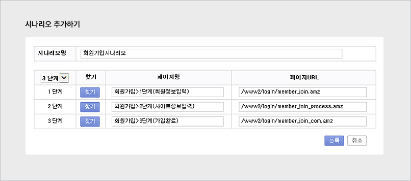
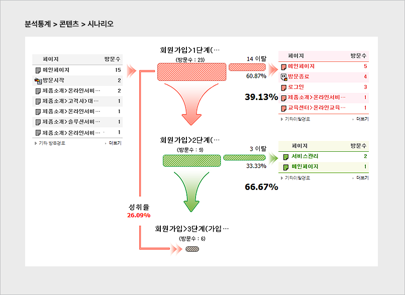

# 시나리오 분석

시나리오 분석은 전환까지 도달하는 이동경로를 미리 정의하고, 방문자가 정의한 시나리오대로 이동하는지 분석하는 기능입니다. 로그 분석을 통해 방문자가 어느 단계에서 이탈하는지 확인할 수 있습니다.

### 1. 시나리오 예시

**회원가입 시나리오**: 약관동의 → 회원정보 입력 → 회원가입 완료

<figure><figcaption></figcaption></figure>

2단계에서 3단계로 넘어가는 과정에서 이탈이 많다면 정보 입력 페이지에 문제가 있을 수 있습니다. 가입 오류 여부, 방문자가 입력을 꾺리는 항목, 폼 입력을 방해하는 요소(이탈을 유도하는 링크 등)를 점검하면 이탈률을 줄이고 성취율을 높일 수 있습니다.

**구매 시나리오**: 장바구니 → 주문정보 입력 → 결제방법 선택 → 주문완료

<figure><figcaption></figcaption></figure>

주문정보까지 모두 입력한 방문자는 구매 의사가 높다고 볼 수 있습니다. 결제방법 선택 단계에서 이탈이 많다면 브라우저별 결제 오류, 특정 결제수단의 문제, 결제 수단의 다양성 부족 등을 점검해 개선해야 합니다.

### 2. 시나리오 설정하기

\[설정 > 콘텐츠 > 시나리오] 메뉴에서 2단계～7단계까지 설정할 수 있습니다. URL 기준으로 설정되므로, 각 진행 단계 페이지의 URL을 먼저 확인한 후 등록해야 합니다.

<figure><figcaption></figcaption></figure>

### 3. 분석 결과 확인

\[분석통계 > 콘텐츠 > 시나리오] 메뉴에서 분석된 시나리오 결과를 확인할 수 있습니다. 단계별 이탈 횟수와 비율, 어떤 페이지로 이탈하는지를 상세히 확인할 수 있습니다. 문제 단계를 개선해 전환율을 높여 보세요.

<figure><figcaption></figcaption></figure>
