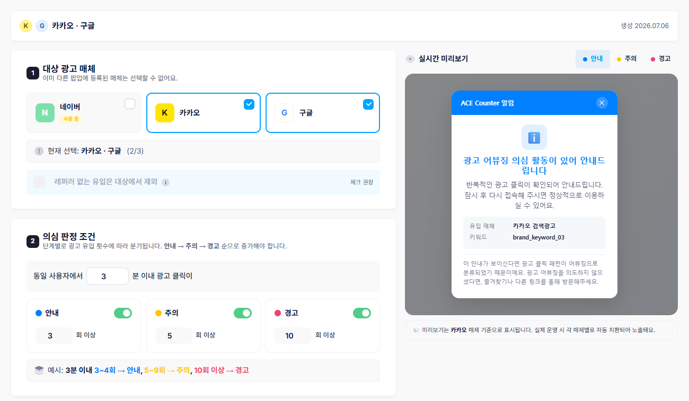
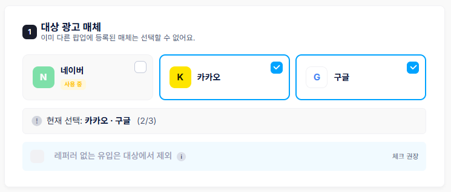
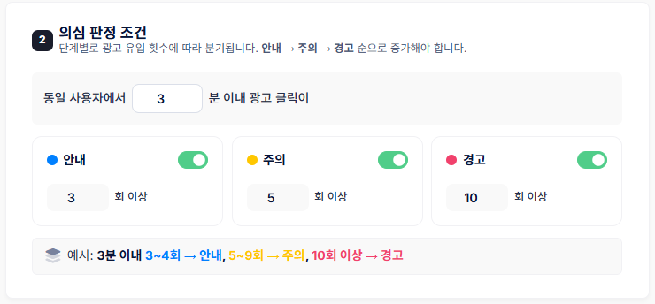
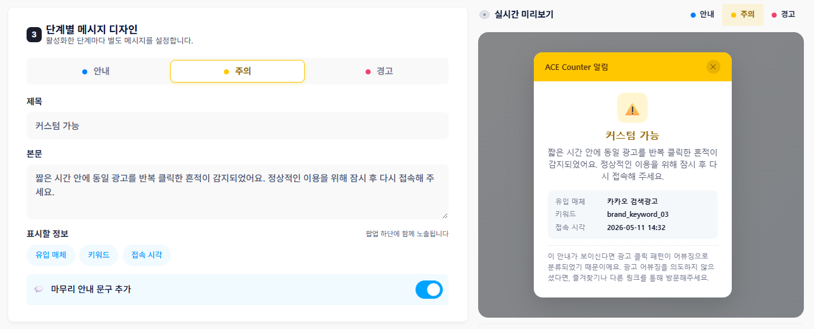
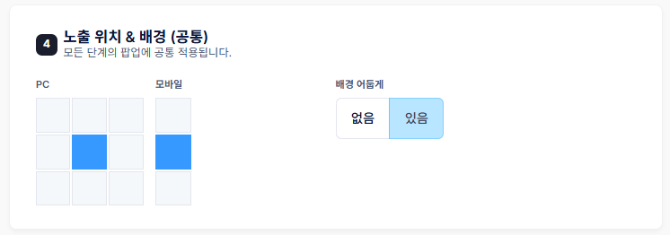

# 의심유입 팝업 만들기

### 의심유입 팝업이란?

부정클릭 의심유입 팝업은 네이버·카카오·구글 광고를 통해 들어온 방문자 중 비정상적으로 반복 클릭하는 사용자를 감지해, 단계별 경고 팝업을 자동으로 노출하는 기능입니다.

팝업이 노출된 IP는 의심 IP로 수집되며, 매체 API를 연동하면 실제 광고 노출까지 자동으로 차단할 수 있습니다. 광고비를 낭비하는 어뷰징 클릭을 줄이고, 이미 발생한 부정클릭은 매체 차단·환급까지 이어서 관리할 수 있습니다.

**부정클릭 관리 프로세스**

1. **경고 팝업 만들기**: 어떤 매체를, 어떤 조건에서, 어떤 메시지로 경고할지 설정합니다.
2. **판정 & 노출**: 설정한 조건에 걸린 방문자에게 실시간으로 팝업이 노출됩니다.
3. **의심 IP 관리**: 팝업이 노출된 IP가 목록에 쌊이며, 여기서 확인하고 차단합니다.
4. **매체 자동 차단**: 매체 API를 연동해 두면 차단한 IP가 광고에서 자동으로 제외됩니다.


팝업만 운영해도 의심 방문자에게 경고를 보내고 데이터를 쌓을 수 있으며, 매체 차단은 필요할 때 활용하면 됩니다.


**3단계 경고 등급**

방문자의 반복 클릭 횟수가 누적되면 아래 순서대로 경고 단계가 올라갑니다. 클릭 횟수와 문구는 직접 설정할 수 있습니다.

| 등급 | 언제 노출되나      | 톤앤매너                        |
| -- | ------------ | --------------------------- |
| 안내 | 초기 반복 클릭 감지  | 정상 사용자에게도 닿을 수 있어 부드러운 문구   |
| 주의 | 명확한 반복 클릭 패턴 | 반복 클릭이 녗녗한 경우, 건조한 문구       |
| 경고 | 강한 어뷰징 의심    | 악의적인 어뷰징이 분명한 경우, 짧고 단호한 문구 |


광고 유입과 부정클릭을 집계하려면 광고 자동추적 설정이 먼저 되어 있어야 합니다. 설정되어 있지 않으면 팝업을 설정해도 데이터가 쌓이지 않습니다.


부정클릭 경고 팝업 메뉴에서 \[+ 새 팝업 만들기] 버튼을 누르면 팝업 편집 화면이 열립니다.

<figure><figcaption></figcaption></figure>

### 1. 대상 광고 매체

경고 팝업을 적용할 매체를 선택합니다. 네이버·카카오·구글 중 하나 이상을 고를 수 있습니다.

<figure><figcaption></figcaption></figure>


한 매체는 하나의 팝업에만 등록할 수 있습니다. 이미 다른 팝업이 사용 중인 매체는 '사용 중'으로 표시되어 선택할 수 없으며, 매체를 옥기려면 기존 팝업을 수정하거나 삭제해야 합니다. 반대로 하나의 팝업에 여러 매체를 등록할 수는 있습니다.


**레퍼러 없는 유입 제외(권장)**: 체크하면 즐겨찾기·주소 직접 입력처럼 광고 클릭이 아닐 수 있는 유입을 판정 대상에서 제외해 오탐을 줍니다.

### 2. 의심 판정 조건

"동일 사용자가 N분 이내에 광고를 M회 이상 클릭하면" 의심으로 판정하도록 조건을 정합니다. 안내·주의·경고 각 단계는 토글로 켜고 끈 수 있으며, 처음 도입한다면 안내 단계만 켜서 1\~2주 데이터를 쌓은 후 단계를 늘리는 방식을 권장합니다.

<figure><figcaption></figcaption></figure>


권장 기본값: 안내 3회 이상 / 주의 5회 이상 / 경고 10회 이상. 임계값을 너무 낮추면 정상 사용자에게도 팝업이 노출될 수 있습니다.


### 3. 단계별 메시지 디자인

켜 둔 단계마다 별도의 메시지(제목, 본문)를 설정할 수 있으며, 팝업 하단에 유입 매체·키워드·접속 시각·접속 IP 등의 정보를 함께 노출할 수 있습니다.

<figure><figcaption></figcaption></figure>


안내·주의 단계에는 정상 사용자를 위한 마무리 안내 문구를 켜 두고, 경고 단계는 짧고 단호하게 유지하는 방식이 효과적입니다.


### 4. 노출 위치 & 배경(공통)

모든 단계에 공통 적용되는 설정입니다. PC는 3×3 격자에서 9개 위치 중, 모바일은 상·중·하 3개 위치 중에서 선택합니다. 배경을 어둡게 설정하면 팝업의 주목도를 높일 수 있습니다.

<figure><figcaption></figcaption></figure>

### 5. 저장하기

매체를 1개 이상 선택하고 판정 단계를 1개 이상 켜면 \[저장하고 운영 시작] 버튼이 활성화됩니다. 저장 즉시 해당 매체에서 팝업 운영이 시작됩니다.
