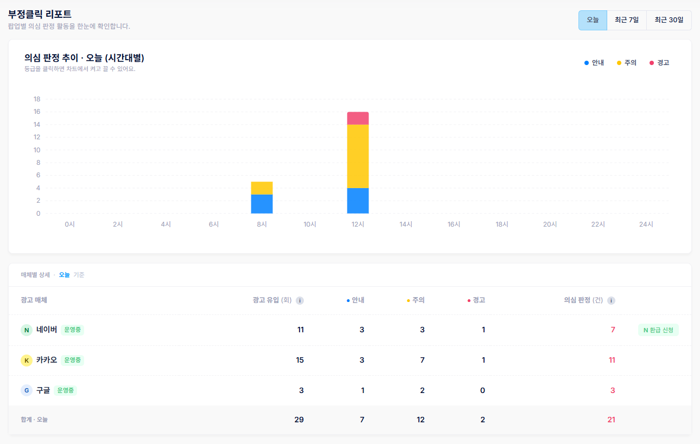
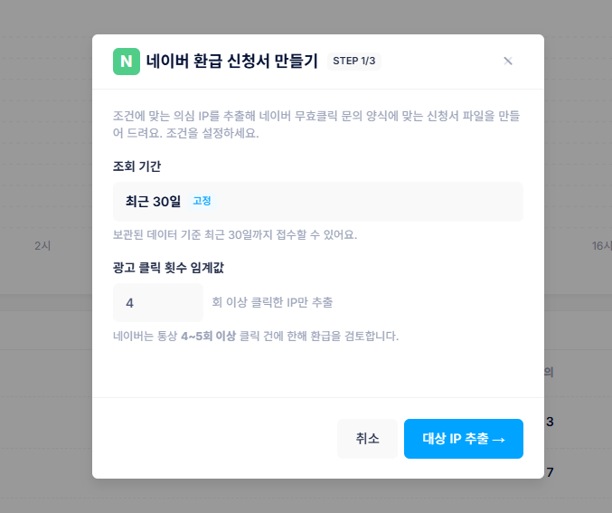
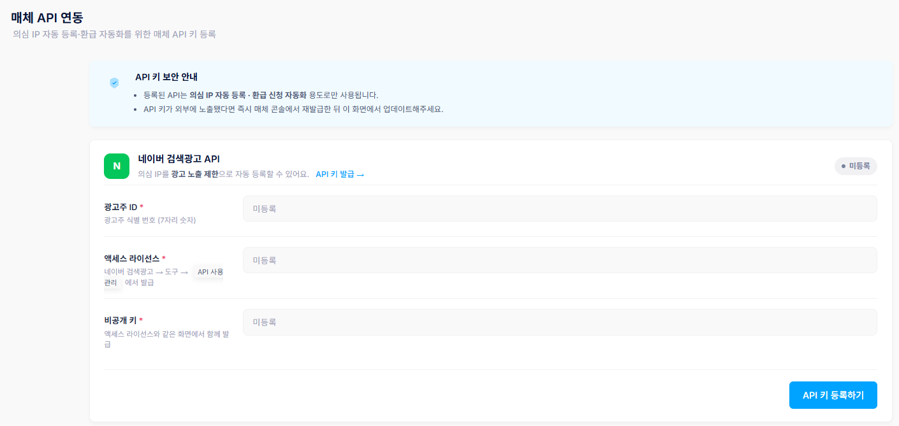

# 부정클릭 리포트 및 의심 IP 관리

### 1. 부정클릭 리포트 확인

부정클릭 경고 팝업 메뉴의 첫 화면에서 운영 현황과 리포트를 한눈에 볼 수 있습니다. 오늘/최근 7일/최근 30일 기간으로 조회할 수 있습니다.

<figure><figcaption></figcaption></figure>

* **추이 차트**: 안내·주의·경고 건수를 쌓아 표시하며, 상단 범례를 클릭해 항목별로 켜고 끈 수 있습니다.
* **매체별 상세 표**: 매체별 광고 유입 수, 판정 기준, 등급별 판정 건수, 의심 판정 합계를 보여줍니다.

**네이버 부정클릭 환급 신청**: 매체별 상세 표의 네이버 항목에서 \[환급 신청] 버튼을 누르면 의심 IP를 네이버 무효클릭 문의로 자동 제출하는 마법사가 열립니다.

<figure><figcaption></figcaption></figure>



#### STEP 1 · 조건 설정

조회 기간과 광고 클릭 횟수 임계값을 설정해 환급 대상 IP를 결정합니다.



#### STEP 2 · 대상 확인

추출된 대상 IP를 파일로 다운로드받습니다.



#### STEP 3 · 제출

네이버 무효클릭 문의 페이지로 이동해 제출합니다.




네이버는 통상 최근 3개월 이내 데이터, 4\~5회 이상 클릭 건에 한해 환급을 검토합니다.


### 2. 의심 IP 관리

팝업이 노출된 방문자의 IP가 이 화면에 표시됩니다. 어뷰징이 의심되는 IP를 확인해 차단하고, 매체 API를 연동하면 실제 광고 노출까지 차단할 수 있습니다.

**의심 IP 확인 & 차단**: '의심 IP' 탭에는 아직 차단하지 않은 IP가, '차단됨' 탭에는 이미 차단한 IP가 나뉘어 표시됩니다. IP를 클릭하면 같은 방문자가 쓴 다른 IP와 유입 이력(시각·매체·키워드·노출된 경고 등급)을 볼 수 있습니다. \[차단]으로 개별·선택 차단할 수 있고, '차단됨' 탭의 \[해제]로 다시 광고 유입을 허용할 수 있습니다.


IP 옷의 '🔄 +N' 표시는 같은 방문자가 다른 IP도 사용 중이라는 뜻입니다. 차단하면 그 IP들도 함께 차단되며, 이후 새 IP로 접속해도 동일 방문자면 자동으로 추가 차단됩니다.



IP 차단이 실제 광고에 반영되려면 아래 매체 API 연동이 되어 있어야 합니다.


**매체 API 연동**

<figure><figcaption></figcaption></figure>

* **네이버 검색광고 API**: \[API 키 등록하기]를 누르고 광고주 ID(7자리 숫자), 액세스 라이선스, 비공개 키를 입력합니다(네이버 검색광고 > 도구 > SA API 사용관리에서 확인). \[저장 후 테스트]를 누르면 연결이 확인되고 '연결됨' 배지가 표시됩니다.
* **Google Ads API**: 구글 광고 IP 주소 제외 기능은 공지 예정입니다.
* **카카오**: 외부 API를 통한 IP 자동 차단을 지원하지 않습니다. 카카오 IP는 '차단됨' 목록에 등록만 되며, 실제 차단은 카카오 비즈니스 콘솔에서 직접 설정해야 합니다.


등록된 API는 의심 IP 자동 등록·환급 신청 자동화 용도로만 사용됩니다. 키가 외부에 노출되면 매체 콘솔에서 재발급 후 이 화면에서 업데이트해 주세요.

