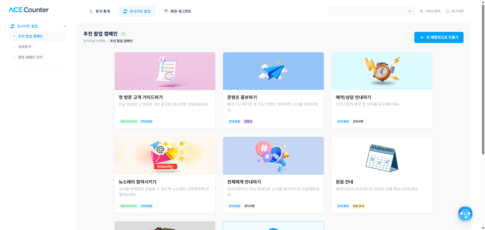
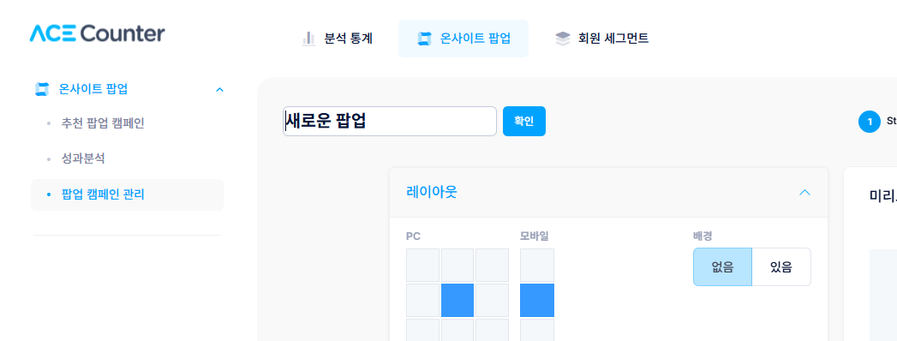
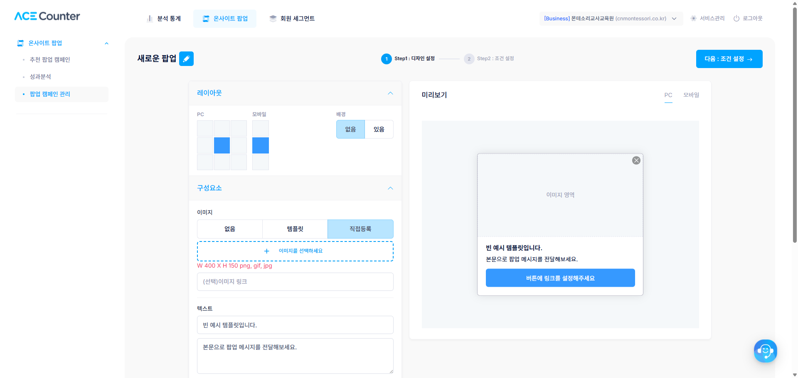
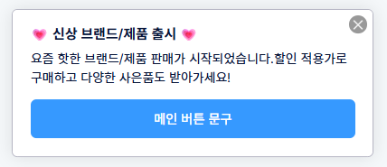
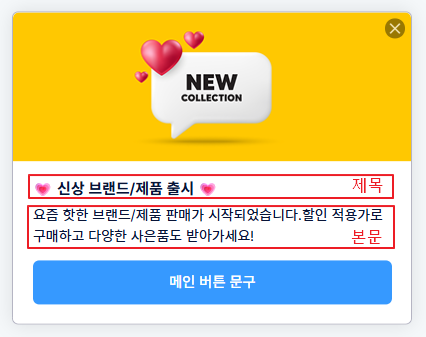
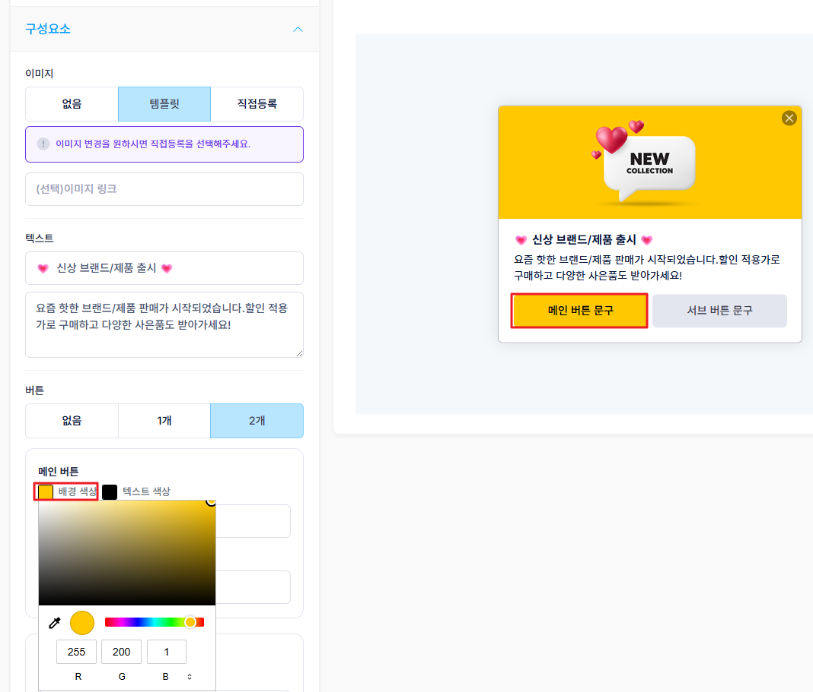

# 마케팅 팝업 만들기

### STEP 1. 신규 생성



#### 캠페인 만들기

\[온사이트 마케팅 > 추천 캠페인] 메뉴에서 원하는 템플릿에 마우스를 올려 \[캠페인 새로 만들기]를 클릭하거나, 우상단의 \[빈 템플릿으로 만들기]를 클릭해 처음부터 커스텀할 수 있습니다.

<figure><figcaption></figcaption></figure>



#### 캠페인 이름 설정

페이지 상단의 캠페인 이름 영역에서 연필 아이콘을 클릭해 이름을 입력하거나 수정합니다. 저장 후에도 \[팝업 캼페인 관리] 메뉴에서 다시 수정할 수 있습니다.

<figure><figcaption></figcaption></figure>



### STEP 2. 디자인 설정

<figure><figcaption></figcaption></figure>

**레이아웃**: 팝업이 노출될 위치(PC 9개, 모바일 3개 위치 중 선택)와 배경 딤드 처리 여부를 설정합니다. 배경이 있으면 팝업의 주목도를 높일 수 있으며, 팝업을 닫거나 버튼을 클릭하기 전까지 다른 영역을 클릭할 수 없습니다.

**구성요소**

* 이미지: 없음 / 템플릿 / 직접등록(가로 150px × 세로 100px, png·gif·jpg) 중 선택하며, 이미지에 링크를 선택적으로 삽입할 수 있습니다.

<figure><figcaption></figcaption></figure>

* 텍스트: 제목과 본문으로 구성되며 모두 선택 항목입니다.

<figure><figcaption></figcaption></figure>

* 버튼: 최대 2개까지 설정 가능하며(2개인 경우 메인 버튼은 왼쪽), 버튼이 있으면 문구와 링크는 필수입니다. 색상은 컬러 피커로 조절할 수 있습니다.

<figure><figcaption></figcaption></figure>


쿠폰 발급 기능은 현재 CAFE24 고객에게만 제공됩니다.


| 항목               | 설명                  | 필수 구분            |
| ---------------- | ------------------- | ---------------- |
| 이미지              | 팝업에 노출될 이미지         | 템플릿·직접등록 선택 시 필수 |
| 이미지 링크           | 이미지 클릭 시 이동 링크      | 선택               |
| 텍스트(제목, 본문)      | 팝업에 노출될 텍스트         | 선택               |
| 버튼 텍스트           | 버튼 안의 문구            | 버튼이 있는 경우 필수     |
| 버튼 > 링크          | 버튼 클릭 시 이동 링크       | 링크 이동인 경우 필수     |
| 버튼 > 쿠폰 발급기준일/할인 | 쿠폰 사용 기한, 할인 금액·할인율 | 쿠폰 발급인 경우 필수     |

### STEP3. 저장하기

\[저장] 버튼을 클릭하면 확인 모달이 나타납니다. 저장된 캠페인의 게시 ON/OFF 관리는 \[팝업 캠페인 관리] 메뉴에서 진행할 수 있습니다.
