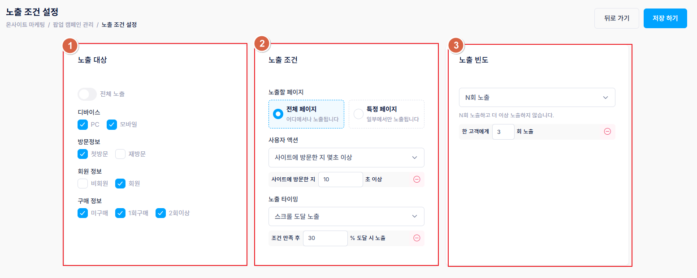
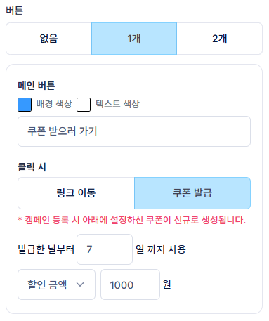

# 팝업 노출 조건 설정

노출 조건 설정은 노출 대상, 노출 조건, 노출 빈도 3가지로 구분됩니다.

<figure><figcaption></figcaption></figure>

### 1. 노출 대상

쇼핑몰 회원의 기본 정보를 기준으로 노출 타겟을 구분합니다.

| 구분    | 설명                               |
| ----- | -------------------------------- |
| 디바이스  | PC/모바일 — 방문 시 사용한 기기 기준          |
| 방문정보  | 첫방문/재방문 — 쿠키에 기록된 이전 방문 정보 기준    |
| 회원 정보 | 비회원/회원 — 로그인 여부 기준               |
| 구매 정보 | 미구매/1회구매/2회구매 — 쿠키에 기록된 구매 횟수 기준 |

### 2. 노출 조건

설정한 노출 대상 중 특정 조건을 만족한 회원에게만 노출되도록 설정할 수 있습니다.

| 조건      | 설명                                                                                                                  |
| ------- | ------------------------------------------------------------------------------------------------------------------- |
| 노출할 페이지 | 전체 페이지 또는 직접 입력한 URL의 특정 페이지                                                                                        |
| 사용자 액션  | 없음 / 구매완료 후 / 회원가입완료 후 / 장바구니 N개·N원 이상 담기 / 상품 N개 이상 조회 / 페이지 N회 이상 조회 / 사이트 방문 N초 이상 중 선택. 구분이 필요 없다면 '없음'을 선택합니다. |
| 노출 타이밍  | 즉시 노출 / N초 경과 시 노출 / 스크롤 N% 도달 시 노출                                                                                 |

### 3. 노출 빈도

한 명의 회원에게 해당 팝업을 얼마나 노출할지 결정하는 피로도 설정입니다.

* 계속 노출하기: 제한 없이 조건을 만족할 때마다 계속 노출
* N회 노출: 최대 N번까지만 노출
* N일 동안 N회 노출: 기간 기준으로 최대 노출 횟수를 지정 (예: 3일 동안 2회 노출이면 첫 노출 후 3일차까지 최대 2번, 4\~6일차에 다시 2회 노출 가능)

### (CAFE24) 쿠폰 생성


쿠폰 기능은 현재 CAFE24 회원에게만 제공되는 기능입니다.


팝업 설정 시 \[버튼 > 클릭 시 옵션]에서 \[쿠폰]을 선택하면 CAFE24 쿠폰을 생성할 수 있습니다. 설정한 쿠폰은 팝업 등록/수정 시점에 자동 생성되며, 팝업 게시 ON/OFF 여부와 관계없이 생성됩니다. 생성된 쿠폰은 CAFE24 쇼핑몰 어드민에서도 확인할 수 있습니다.

<figure><figcaption></figcaption></figure>

* **쿠폰 유효일**: 고객이 팝업 버튼을 클릭해 쿠폰을 받은 순간부터 설정한 N일까지 유효합니다.
* **할인 금액/할인율**: 금액(원) 또는 퍼센트 할인율로 설정할 수 있습니다.


현재 쿠폰 기능은 모든 상품·모든 회원에게 사용 가능한 상태로 발급되므로, 쿠폰을 받는 대상을 고려해 팝업을 노출해 주세요. 또한 CAFE24 쿠폰은 기본적으로 중복 발급이 되지 않아, 한 명의 회원이 같은 팝업으로 여러 번 쿠폰을 받을 수 없습니다.

