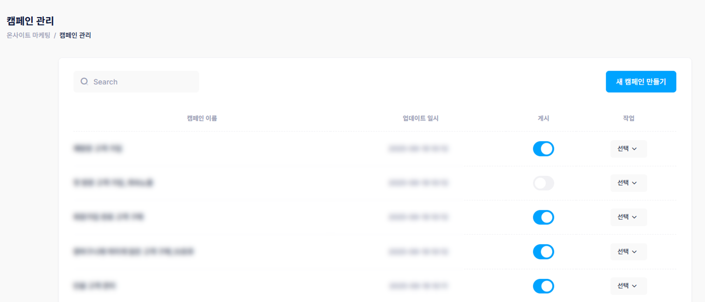
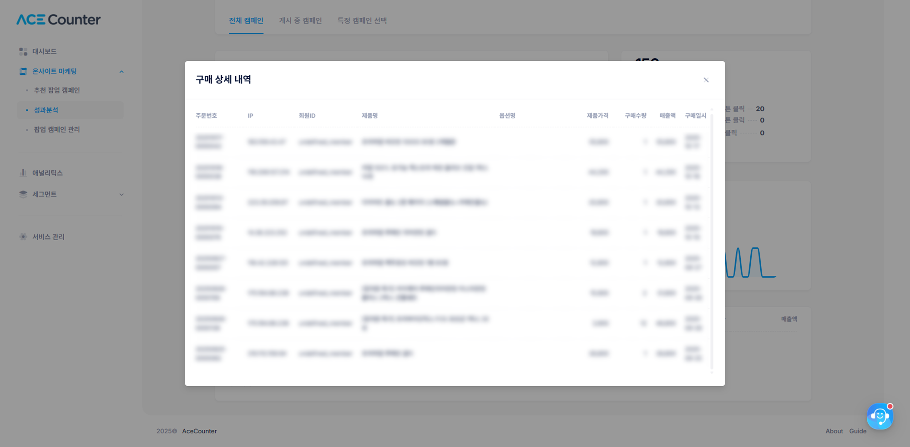
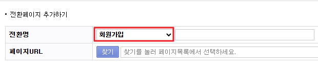

# 팝업 목록 관리 및 성과 확인

### 1. 팝업 목록 관리

등록한 팝업 캠페인을 모두 확인할 수 있는 목록을 제공합니다.

* 게시 ON/OFF 버튼으로 사이트 노출을 제어할 수 있습니다.
* 수정/삭제 등의 작업을 수행할 수 있습니다.
* 상단 검색 기능으로 팝업 이름을 빠르게 찾을 수 있습니다.

<figure><figcaption></figcaption></figure>

팝업 명을 클릭하거나 작업 버튼에서 수정하기를 클릭하면 수정 화면으로 바로 이동합니다. 이미 게시된 팝업도 언제든지 수정할 수 있습니다.


팝업 이름을 변경하면 성과 데이터에 표시되는 팝업 이름도 함께 변경됩니다. 팝업을 삭제하면 성과 데이터는 삭제된 팝업으로 노출됩니다.


### 2. 팝업성과 확인

**캠페인 선택 및 기간 설정**: 전체 캠페인, 게시중 캠페인, 또는 특정 캠페인을 선택할 수 있으며, 기본값은 최근 7일입니다.

**시각화 차트**

* 성과 추이(막대그래프): 기간별 노출수·클릭수의 일별 추이
* 캠페인 전체 클릭 비율: 버튼·이미지·닫기 클릭 비율
* (Commerce) 구매 전환 추이: 구매건수 흐름
* (Business) 회원가입 추이: 회원가입수 흐름

**상세 지표**

| 지표    | 설명                       |
| ----- | ------------------------ |
| 노출수   | 팝업이 화면에 표시된 총 횟수         |
| 클릭수   | 팝업 내 버튼 또는 이미지를 클릭한 총 횟수 |
| CTR   | 클릭수 ÷ 노출수                |
| 회원가입수 | 팝업 클릭 후 회원가입까지 완료한 건수    |
| 구매건수  | 팝업 이후 발생한 총 구매 횟수        |
| 구매율   | 구매건수 ÷ 클릭수               |
| 매출액   | 팝업 이후 발생한 결제 금액          |

구매건수 숫자를 클릭하면 팝업 노출 후 구매가 발생한 세션의 주문건 정보(주문번호, IP, 회원 ID, 제품명, 옵션명, 제품가격, 구매수량, 매출액, 구매일시)를 확인할 수 있습니다.

<figure><figcaption></figcaption></figure>

### 3.  성과 이해하기


현재 버전에서 제공하는 전환은 회원가입 완료와 구매 2가지입니다. 다른 전환 성과도 측정할 수 있도록 점차 확대해 나갈 예정입니다.


**회원가입 완료 전환**: 방문자가 회원가입을 완료해 회원가입 완료 페이지에 도달하면 전환으로 기록합니다. 전환은 하나의 방문 세션 내에서 중복 카운트되지 않습니다(세션이 끓기지 않은 경우). 전환 설정 시 전환 구분 값을 '회원가입'으로 지정해야 전환으로 인정되며, '회원가입'으로 여러 개의 전환을 만들면 각각을 별도 전환으로 인정해 모두 회원가입 전환 카운트에 포함합니다.

<figure><figcaption></figcaption></figure>

**구매 이해하기**: 페이지뷰 이벤트 기반의 전환과 다르게, 구매는 동일한 세션에서 여러 번 발생해도 각각을 모두 카운트합니다. 구매 완료 페이지에서 측정되지만, 구매 이벤트 자체를 중복 없이 모두 집계한다는 점에서 전환과 차이가 있습니다.
