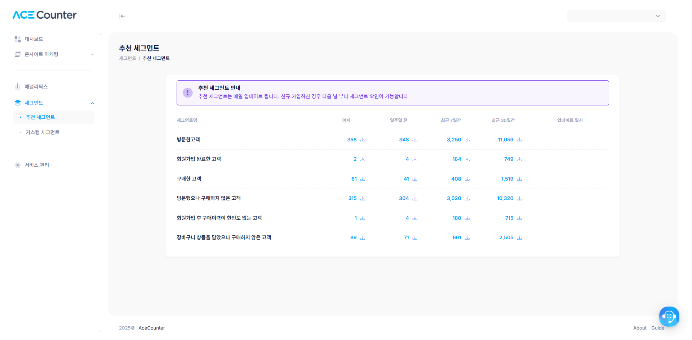
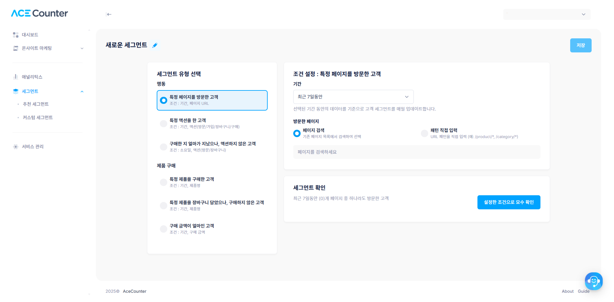

# 세그먼트 관리

#### 세그먼트 이해하기

타겟 세그먼트란 특성에 따라 분류할 수 있는 사용자 그룹을 의미합니다. 예를 들어 '어제 방문한 사람', '오늘 구매한 사람'처럼 사이트에 방문한 고객의 데이터를 기준으로 그룹을 나눌 수 있습니다.


에이스카운터 스크립트가 설치된 분석 시작일의 다음 날부터 정상적으로 세그먼트를 이용할 수 있습니다.



세그먼트는 오늘 기준 최대 120일 전\~어제까지의 데이터로 생성됩니다. 에이스카운터로 분석한 데이터를 기반으로 세그먼트가 생성되므로, 처음 이용하는 경우 데이터가 없어 세그먼트를 만들 수 없습니다.


#### 추천 세그먼트

가장 많이 사용되는 6개 세그먼트를 매일 업데이트하여 제공합니다. 동일한 세그먼트에 대해 각각 `어제`, `7일전`, `최근 일주일`(7일전\~어제) 기준으로 나눠 총 18개 세그먼트를 사용할 수 있습니다.

**세그먼트 다운로드**: 세그먼트의 숫자를 클릭하면 해당 세그먼트(업데이트된 기준)를 csv 파일로 다운로드할 수 있습니다.


업데이트되는 세그먼트와 그렇지 않은 세그먼트를 구분해 주의해야 합니다.

1. 2024.07.25일에 '어제 방문한 고객' 세그먼트로 A 메시지를 발송했다면, A 메시지를 받은 대상은 2024.07.24일에 방문한 사람입니다.
2. 일주일 후 2024.08.01일에 같은 '어제 방문한 고객' 세그먼트로 B 메시지를 발송했다면, B 메시지를 받은 대상은 2024.07.31일에 방문한 사람입니다. (기준일이 매일 갱신됩니다.)


<figure><figcaption></figcaption></figure>

#### 커스텀 세그먼트

세그먼트의 세부 조건(날짜, 페이지, 제품명 등)을 원하는 값으로 직접 설정할 수 있습니다. 필요한 세그먼트 종류를 선택하고 나만의 세그먼트를 만들어 보세요.

<figure><figcaption></figcaption></figure>


오늘 기준 120일 전\~어제까지의 데이터로 세그먼트를 만들 수 있습니다. 특정 날짜를 고정하여 만들면 업데이트되지 않고 그 상태로 저장됩니다. 커스텀 세그먼트의 종류는 계속해서 추가될 예정입니다.

