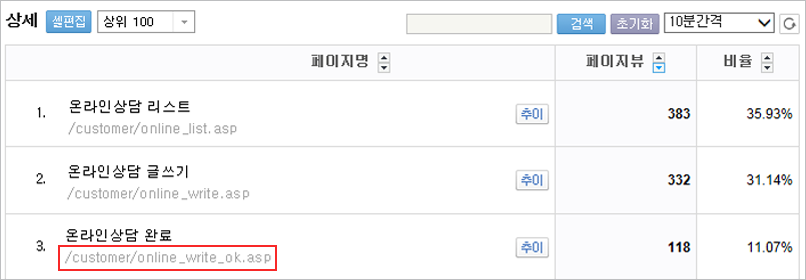

# 클릭 이벤트(링크 클릭) 분석 설치

다음과 같은 경우에 클릭 이벤트(링크 클릭) 분석이 필요합니다.

* 상담신청 완료(예약, 회원가입, 이벤트 신청 등)을 전환으로 분석하고 싶은데, 사이트 구조상 완료/처리 페이지가 없는 경우
* 플래시(Flash) 또는 AJAX로 제작되어 링크 클릭 시 페이지가 재로딩되지 않아 페이지별 분석이 어려운 경우
* 모바일웹에서 전화걸기 버튼 클릭을 전환으로 분석하고 싶은 경우

#### 설치 방법

링크 클릭 이벤트를 가상의 페이지로 분석하는 방식이며, 링크가 위치한 페이지에 별도 세팅이 필요합니다. 아래 가이드를 다운로드해 개발자에게 전달하고 설치를 진행해 주세요.

**📂 클릭이벤트 분석 가이드 다운로드**




클릭 이벤트 세팅은 설치 대행이 불가능하며, 자체 설치 후 검수를 요청해 주세요.


#### 데이터 확인

세팅 완료 후 \[분석통계 > 페이지] 메뉴에서 데이터를 확인할 수 있습니다. 링크 클릭을 가상의 페이지로 분석하므로 '페이지붰 = 클릭수'로 이해하면 됩니다. \[분석통계 > 페이지 > 많이 찾는 페이지] 리포트를 참고해 주세요.

가상으로 분석된 페이지의 URL을 전환 페이지로 설정하면, 별도 페이지가 없어도 클릭을 전환으로 분석할 수 있습니다.
