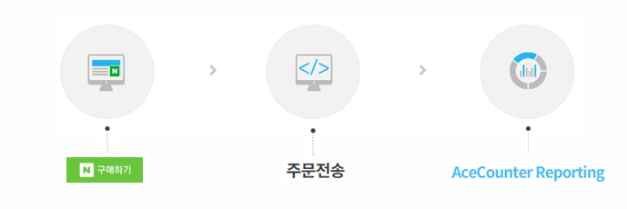
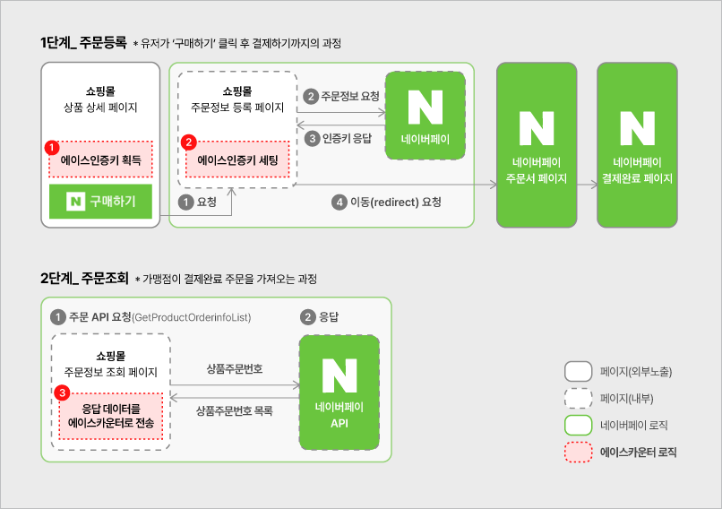
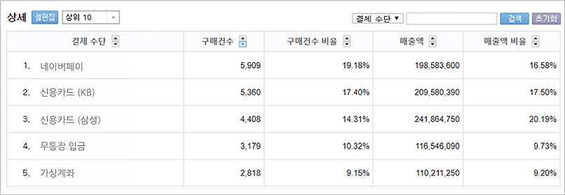

# 네이버페이 연동 가이드

### 1. 네이버페이 타입

네이버페이에는 '결제형'과 '주문형' 두 가지 서비스 타입이 있습니다.

* **결제형**: 결제수단의 하나로 네이버페이 간편결제를 제공하며, 결제 이후 쇼핑몰의 구매완료 페이지로 돌아오기 때문에 에이스카운터 스크립트로 분석이 가능합니다.
* **주문형**: 네이버 ID 로그인 후 네이버 쇼핑으로 넘어가 구매완료까지 이루어집니다. 이 가이드를 참고해 별도로 연동 세팅을 해야만 분석이 가능합니다.




네이버페이 연동을 위해서는 네이버페이 가맹점 연동 가이드에 대한 사전 숙지가 필요합니다.


### 2. 연동 프로세스

인증키 획득 → 인증키 세팅(주문 정보 등록) → 응답 데이터 전송, 3단계로 진행됩니다.



### 3. 연동 방법

**1) 제품상세 페이지 - 에이스 인증키 획득 (공통)**

네이버페이 버튼 핸들러 함수(buy\_nc)에서 에이스 인증키를 획득하여, 주문정보 등록 URL 파라미터로 전송합니다.

```javascript
function buy_nc(url) {
  var check = checkOption(...);
  if (check) {
    try {
      var acePid = window._AcePID; // 에이스 인증키 획득
    } catch (e) {}
    location.href = url + "?customcode=" + acePid; // 에이스 인증키를 주문정보 등록 url 파라미터로 전송
  }
}
```

**2) 주문 정보 등록 페이지 - 에이스 인증키 세팅**

주문정보 등록 시 `merchantCustomCode1` 요소 값으로 앞 단계에서 획득한 에이스 인증키를 넣어 등록합니다. (1.0 버전은 `MALL_MANAGE_CODE`)

| 버전               | v1.0 (= API 4.1)   | v2.1 (= API 5.0)      |
| ---------------- | ------------------ | --------------------- |
| 주문등록 데이터 방식      | 쿼리스트링              | XML                   |
| '에이스 인증키' 저장 key | `MALL_MANAGE_CODE` | `merchantCustomCode1` |



```php
<?
// 에이스 인증키를 MALL_MANAGE_CODE 로 설정
if (isset($_REQUEST["customcode"])) {
  $queryString .= '&MALL_MANAGE_CODE=' . $_REQUEST["customcode"];
}
?>
```



```xml
<!-- 에이스 인증키를 merchantCustomCode1 로 설정 -->
<order>
  <merchantId>상점ID</merchantId>
  <certiKey>인증키</certiKey>
  <interface>
    <merchantCustomCode1>에이스인증키</merchantCustomCode1>
  </interface>
</order>
```

```php
<?
// xml 생성을 위한 php 코드
if (isset($_REQUEST["customcode"])) {
  $data .= '<interface><merchantCustomCode1>' . $_REQUEST["customcode"] . '</merchantCustomCode1></interface>';
}
?>
```



**3) 주문 정보 조회 페이지 - 응답 데이터 전송**

네이버페이 API `GetProductOrderInfoList`로 결제 완료된 상품 리스트를 응답받아, `MerchantCustomCode1`(4.1 버전은 `MallManageCode`) 속성이 있고 빈 값이 아닌 경우에만 전송합니다. HTTPS 통신이 가능한 cURL 등으로 전송하며, 전송 URL은 해당 속성값입니다.

**파라미터**

| 필드명     | 타입     | 필수 | 설명                              |
| ------- | ------ | -- | ------------------------------- |
| orderNo | string | Y  | 주문번호                            |
| pay     | string | Y  | 결제수단                            |
| ll      | string | Y  | 상품 리스트. 속성은 `@`, 상품 묶음은 `^`로 구분 |


전송 URL 끝에는 반드시 `&`를 추가하고, 중복 수집 방지를 위해 주문은 최초 1회만 전송해야 합니다.




```php
<?
// GetProductOrderListAPI 요청 - MallManageCode 사용
$sOrderNo = {주문번호};
$sPay = {결제수단};
$ll = {상품리스트};
$curl = "https://" . $MallManageCode . "&ll=" . $ll . "&pay=" . $sPay . "&orderno=" . $sOrderNo . "&";
$ch = curl_init();
curl_setopt($ch, CURLOPT_URL, $curl);
curl_setopt($ch, CURLOPT_HEADER, 0);
curl_setopt($ch, CURLOPT_RETURNTRANSFER, 1);
curl_setopt($ch, CURLOPT_SSL_VERIFYPEER, 0);
curl_setopt($ch, CURLOPT_SSLVERSION, 3);
curl_setopt($ch, CURLOPT_FOLLOWLOCATION, true);
$ret = curl_exec($ch);
curl_close($ch);
?>
```



```php
<?
// GetProductOrderListAPI 요청 - MerchantCustomCode1 사용
$sOrderNo = {주문번호};
$sPay = {결제수단};
$ll = {상품리스트};
$curl = "https://" . $MerchantCustomCode1 . "&ll=" . $ll . "&pay=" . $sPay . "&orderno=" . $sOrderNo . "&";
$ch = curl_init();
curl_setopt($ch, CURLOPT_URL, $curl);
curl_setopt($ch, CURLOPT_HEADER, 0);
curl_setopt($ch, CURLOPT_RETURNTRANSFER, 1);
curl_setopt($ch, CURLOPT_SSL_VERIFYPEER, 0);
curl_setopt($ch, CURLOPT_SSLVERSION, 3);
curl_setopt($ch, CURLOPT_FOLLOWLOCATION, true);
$ret = curl_exec($ch);
curl_close($ch);
?>
```



**4) 주문 정보 조회 페이지 - 상품리스트 생성**

상품 속성은 `@`, 여러 상품 묶음은 `^`로 구분해 생성합니다. 상품 가격은 상품 소계(구매 합계) 기준입니다.

```php
<?
$productArray = array();
$cnt = 0;
// 구매상품을 A, B라고 가정, 구매상품만큼 배열 추가
$ornList[] = array("pcategory"=>A상품카테고리, "pname"=>A상품명, "pcode"=>A상품번호, "pprice"=>A상품가격, "pquantity"=>A구매개수);
$ornList[] = array("pcategory"=>B상품카테고리, "pname"=>B상품명, "pcode"=>B상품번호, "pprice"=>B상품가격, "pquantity"=>B구매개수, "opt"=>B옵션명);

// 특수문자(#&^@,) 및 태그 제거 함수
function removeStr($s, $m = 0) {
  $ret = "";
  if ($m === 1) {
    $ret = preg_replace("/[#&^@,]*/s", "", $s);
  } else if ($m === 2) {
    $ret = preg_replace("/[<][^>]*[>]*/s", "", $s);
    $ret = preg_replace("/[#&^@,]*/s", "", $ret);
  } else {
    $ret = preg_replace("/[#&^@,]*/s", "", $s);
  }
  return $ret;
}

// 상품리스트를 스트링으로 변환해 배열로 저장 (표준형식: 카테고리명@상품명@상품가격@수량@상품ID@옵션명)
foreach ($ornList as $pVal) {
  $pCategory = removeStr($pVal['pcategory']);
  $pName = removeStr($pVal['pname'], 2);
  $pCode = removeStr($pVal['pcode']);
  $pPrice = removeStr($pVal['pprice'], 1);
  $pQuantity = removeStr($pVal['pquantity'], 1);
  $pOptName = removeStr($pVal['opt'], 1);
  $strTemp = $pCategory . "@" . $pName . "@" . $pPrice . "@" . $pQuantity . "@" . $pCode . "@" . $pOptName;
  $productArray[$cnt] = $strTemp;
  $cnt++;
}
$sOrderNo = "{주문번호}";
$sPay = "{결제수단}";
$ll = urlencode(implode("^", $productArray) . "^"); // 상품리스트
?>
```

**5) 데이터 확인**

에이스카운터 로그인 후 \[분석통계 > 구매자 > 결제 수단 분석] 메뉴에서 확인할 수 있습니다. 구매자의 브라우저가 종료된 후 약 40분 이후에 데이터가 반영됩니다.


