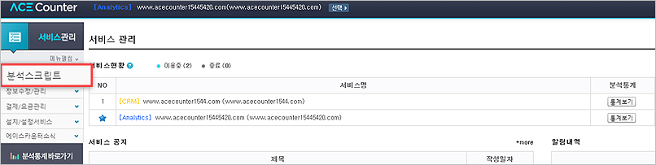
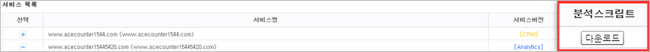

# 기본 스크립트 설치

분석 스크립트는 웹사이트의 방문자 데이터와 주요 행동 데이터를 수집하기 위해 사이트 소스에 삽입하는 자바스크립트 태그입니다. 스크립트 설치가 완료되어야 분석 리포트에 데이터가 표시되므로, 회원가입 후 가장 먼저 진행해 주세요.


스크립트 설치가 어렵다면 에이스카운터의 전문 개발자를 통한 설치 대행 서비스(최초 1회 무료)를 이용할 수 있습니다. 소스를 수정할 수 있는 FTP 정보(주소, PORT, ID, PW) 전달이 필요합니다.


### 설치 절차



#### 분석 스크립트 다운로드

\[서비스 관리 > 분석 스크립트 > 다운로드·직접설치] 메뉴에서 등록한 서비스의 스크립트를 다운로드하고 압축을 해제합니다. (파일명 예: script(도메인주소).zip)




#### 웹 서버(FTP) 소스에 스크립트 적용

압축 해제한 스크립트 파일을 웹 서버 공통 영역 소스에 설치합니다.

* 공통 스크립트 설치: 모든 페이지에서 동작하며 기본 방문/유입 데이터를 수집합니다.
* 환경변수 스크립트 설치: 회원가입, 장바구니, 구매완료 등 주요 전환 페이지에 적용하여 상세 데이터를 수집합니다.



#### 설치 정상 여부 확인

\[분석 리포트 > 실시간 방문자] 메뉴에서 접속 기록이 실시간으로 확인되면 공통 스크립트가 정상 동작하는 것입니다. 상세 환경변수 값까지 확인하려면 AceCounter 설치 확인 크롬 확장 프로그램을 활용해 주세요.



***

### 공통 스크립트


필수로 설치해야 하는 스크립트입니다.


**삽입 위치**: HTML 파일의 `<body>`와 `</body>` 사이 또는 `<head>`와 `</head>` 사이입니다.

환경변수 스크립트를 함께 설치하는 경우, 공통 스크립트는 환경변수 스크립트보다 하단(Footer 영역)에 위치해야 합니다.
