# 구 버전 스크립트 안내


프로 / 이비즈 / 이커머스 / 모바일웹 등 구 버전 이용 고객을 위한 설치 가이드입니다.

* 프로 버전: 공통 스크립트만 설치
* 이비즈 버전: 공통 스크립트 + 환경변수 스크립트(회원분석만)
* 이커머스 / 모바일웹 버전: 공통 스크립트 + 환경변수 스크립트(회원분석/구매분석/내부검색어 모두 해당)




**기본 삽입 위치**: HTML 파일의 `<body>`와 `</body>` 사이 또는 `<head>`와 `</head>` 사이. 환경변수를 함께 세팅하는 경우 공통 스크립트를 Footer(하단 공통 영역)에 설치하는 것을 권장합니다.

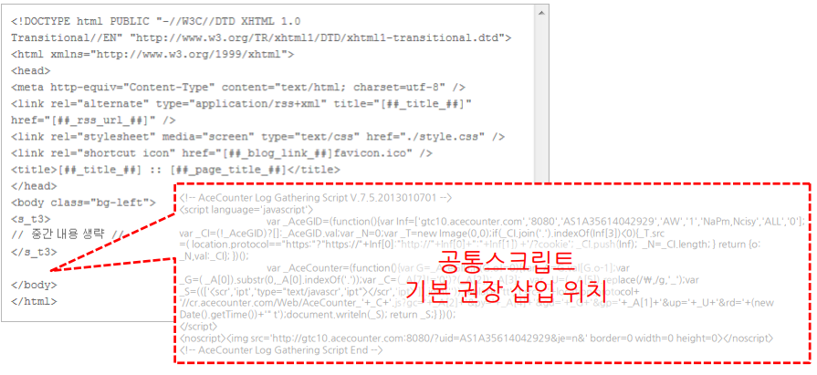

**공통 파일이 있는 경우 (Header/Footer)**

1. FTP에 접속해 도메인에 연결되는 기본 페이지를 확인합니다.
2. 기본 페이지(예: index.php)에서 include 파일이 있는지 확인합니다.
3. 해당 공통 파일이 다른 페이지에서도 include 되고 있는지 확인합니다.
4. 공통 파일(예: copy.php)을 열어 분석 스크립트를 붙여 넣고 저장 후 업로드합니다.

**공통 js 파일이 있는 경우**

웹 페이지 소스의 js 파일 경로와 FTP 서버의 js 파일 경로가 동일해야 합니다. js 파일 하단에 자바스크립트 선언문(``)을 제거한 공통 스크립트를 삽입합니다. 선언문이 중복 삽입되면 스크립트가 정상 동작하지 않으니 주의해 주세요.

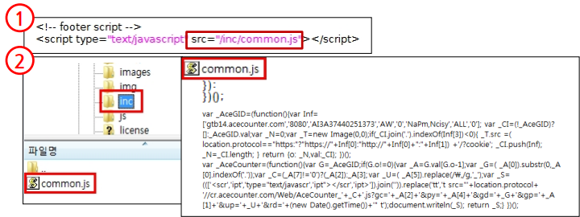

**공통 파일이 없는 경우**

분석하려는 모든 콘텐츠 HTML 페이지 하단에 공통 스크립트를 개별 설치해야 합니다. 스크립트가 설치된 페이지에 대해서만 데이터 수집이 가능합니다.

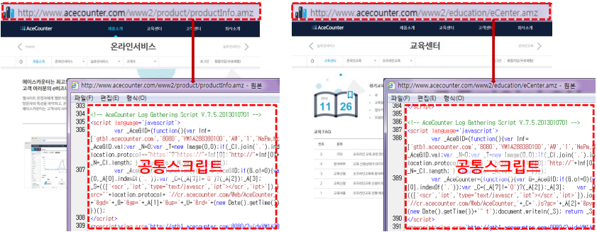



**1. 회원 분석**

* 삽입 위치: 공통 스크립트보다 상단

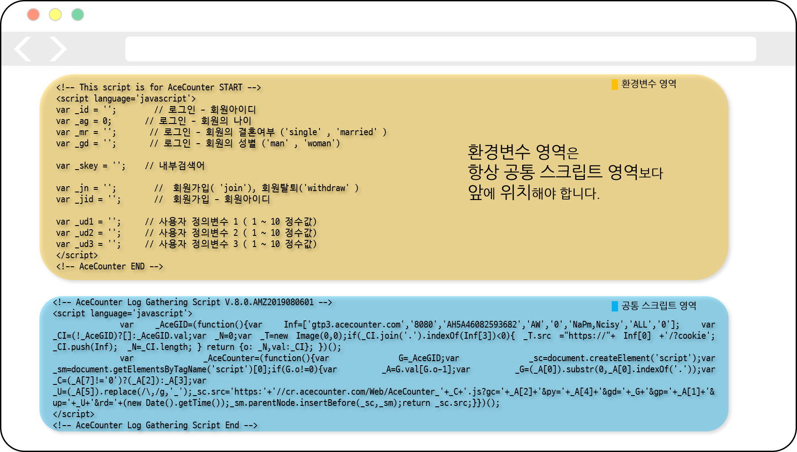

* 회원가입/해지 페이지: '회원가입 아이디(\_jid)'를 실제 사용 변수와 연동 (PHP `<?=$ID변수?>`, ASP `<%=ID변수%>`). 아이디별 분석은 별도 신청이 필요합니다.

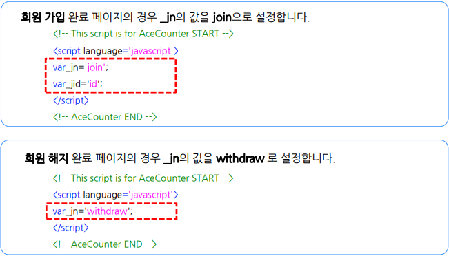

* 로그인 페이지: 로그인 처리 페이지에 설치. 기본 항목(ID, 나이, 성별, 결혼 여부) + 직접 세팅(\_ud1~~3). \_ud1~~3 사용 시 \[설정 > 회원그룹]에서 변수 설정이 필요합니다. 설치 후 \[분석통계 > 회원 분석]에서 확인합니다.

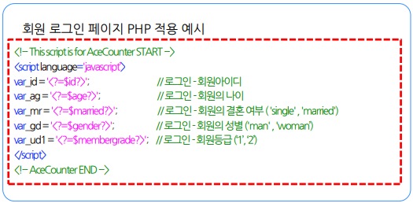

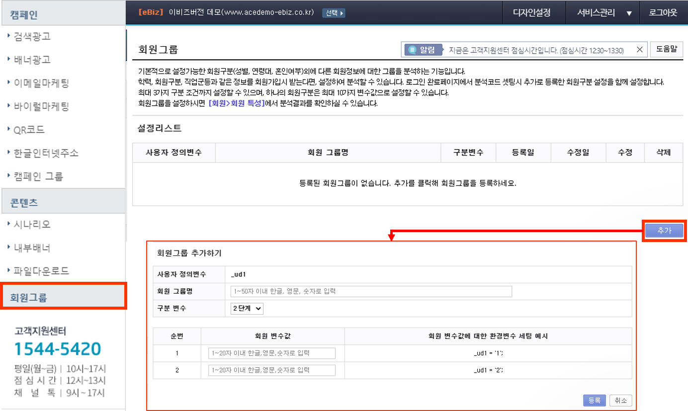

**2. 구매 분석**

* 제품 상세 페이지: `1-Product_Detail.txt` 설치, 공통 스크립트보다 상단에 위치

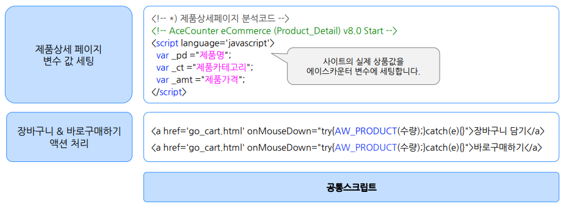

* 장바구니 페이지: `2-Cart_Inout.txt` 설치, 공통 스크립트보다 상단에 위치. 액션 함수는 try-catch로 감싸 예외 처리

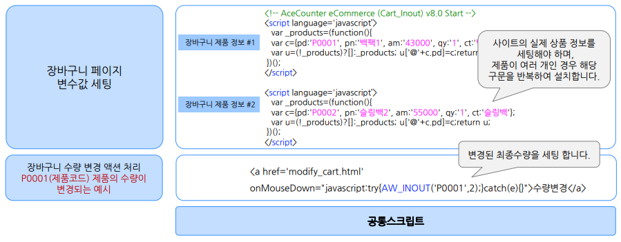

장바구니 수량 변경 액션 처리 예제:

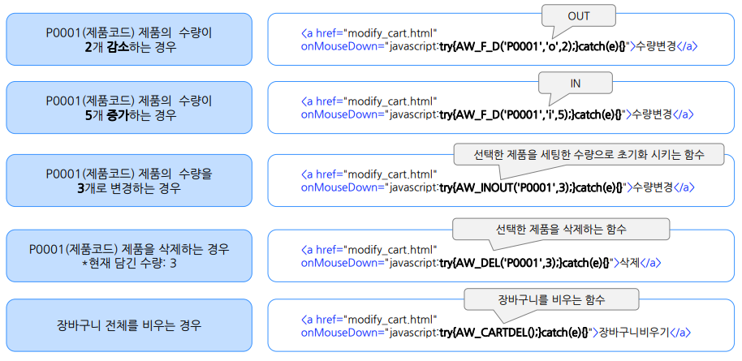

* 구매완료 페이지: `3-Buy_Finish.txt` 설치, 공통 스크립트보다 상단에 위치

**3. 내부 검색어**

내부 검색 기능이 있는 경우, 환경변수 파일 내 `var _skey = '';`를 설정합니다. 분석 결과는 \[콘텐츠 > 내부 검색어]에서 확인합니다.

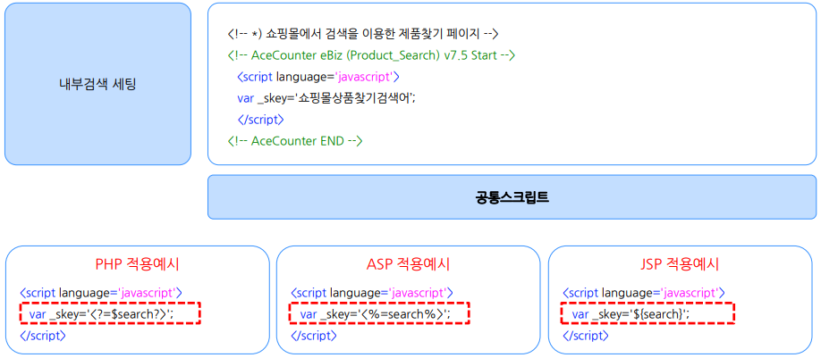


