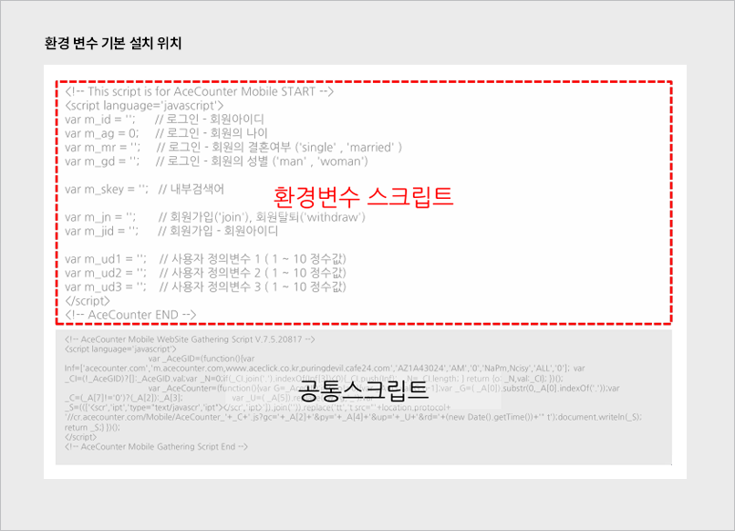
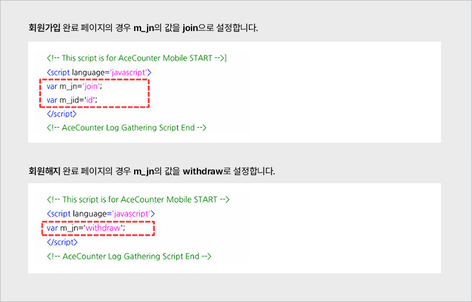
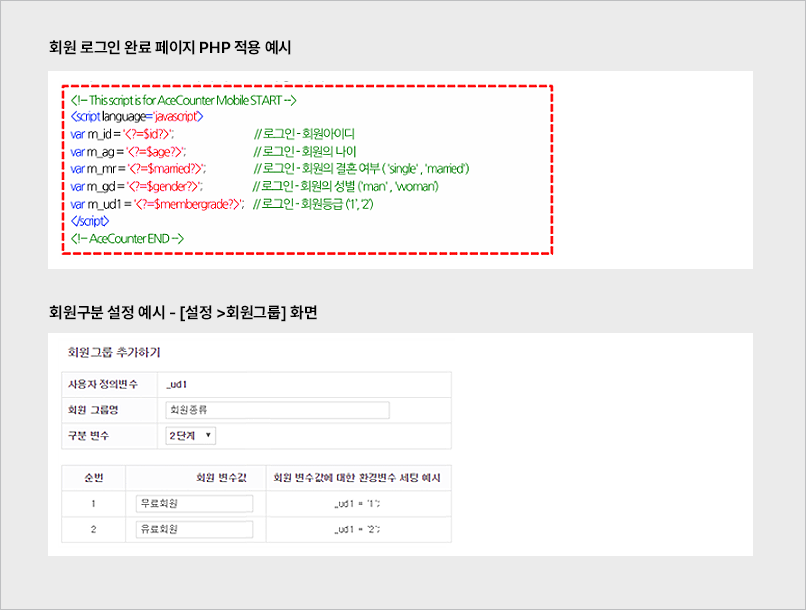
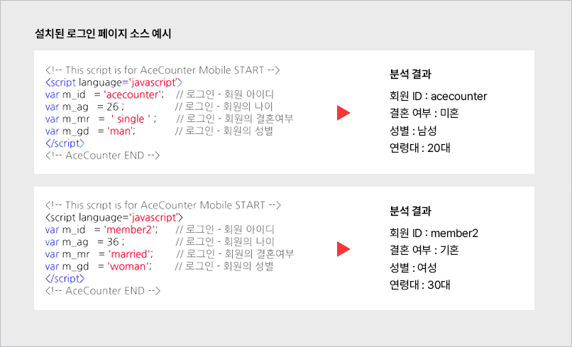
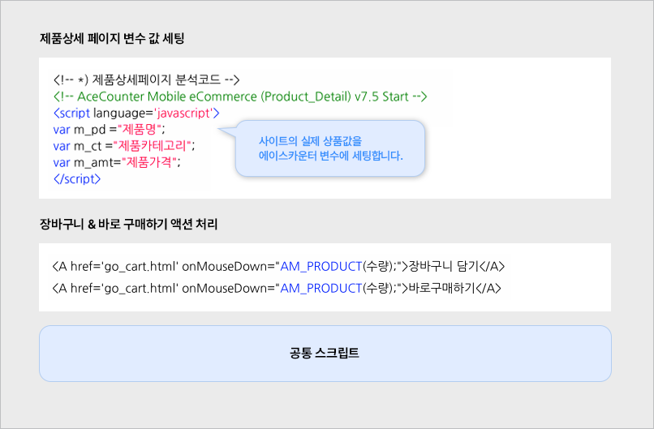
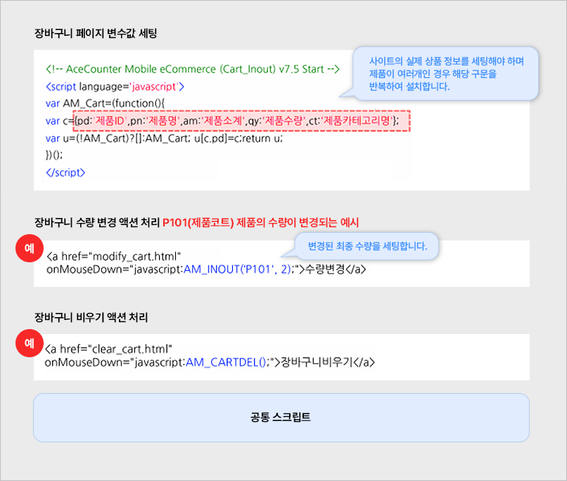
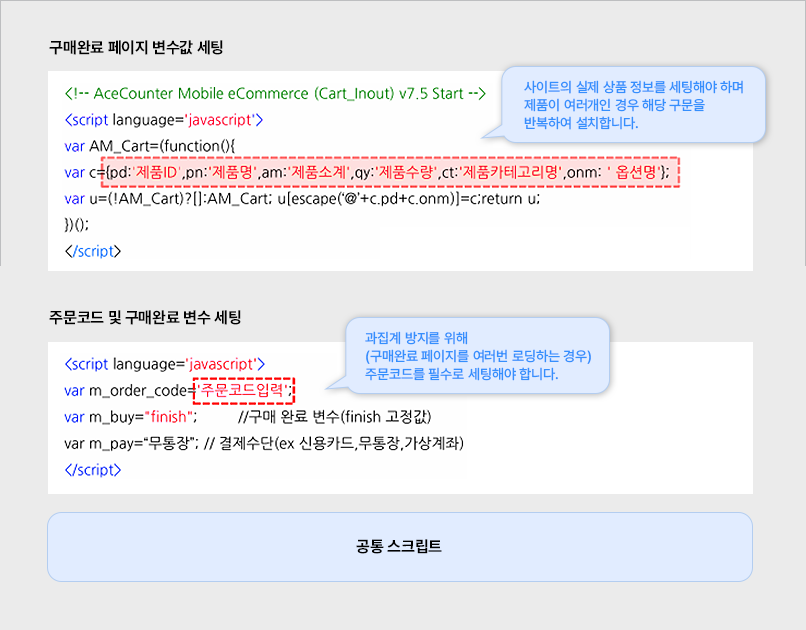
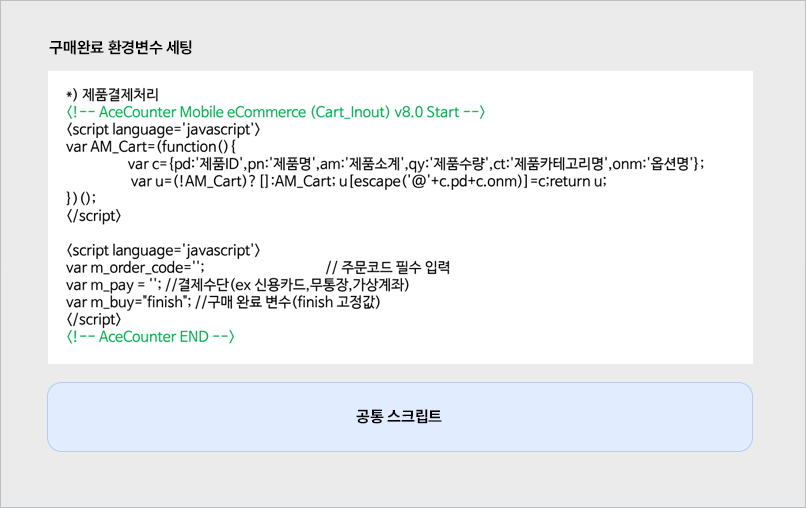
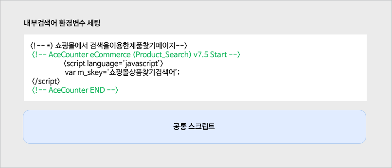

# 환경변수 스크립트 설치


필수 스크립트는 아니며, 분석하고자 하는 데이터에 따라 선택적으로 설치합니다.


회원 분석, 구매 분석, 내부 검색어 데이터를 수집하기 위한 스크립트입니다. 환경변수 스크립트는 공통 스크립트보다 상단에 삽입되어야 정상적으로 분석됩니다.

아래는 환경변수 스크립트 예시입니다. 운영 중인 사이트에 맞게 설정해 주세요.

### 1. 회원가입 / 해지 페이지

'회원가입 아이디(m\_jid)'를 실제 사용 중인 변수와 연동하도록 설정합니다.

* PHP 사이트: `<?=$ID변수?>`
* ASP 사이트: `<%=ID변수%>`

설치 후 \[분석통계 > 회원] 메뉴에서 통계를 확인할 수 있습니다. 아이디별 분석을 위해서는 별도로 회원 아이디별 분석 신청이 필요합니다.

### 2. 로그인 페이지

로그인 처리 페이지에 설치하여 로그인한 사용자 정보를 변수에 세팅합니다.

* 기본 항목: ID, 나이, 성별, 결혼 여부
* 직접 세팅: m\_ud1, m\_ud2, m\_ud3 (회원 구분, 지역 등 원하는 항목을 직접 정의)

m\_ud1\~3 변수를 사용하려면 \[설정 > 회원그룹]에서 사용자 정의 변수 설정이 필요합니다. 설치 완료 후 \[분석통계 > 회원 분석]에서 확인할 수 있습니다.

### 3. 제품 상세 페이지

제품 노출수, 구매율, 장바구니 담김수, 이탈 매출 분석을 위한 설치입니다. 제품 상세 페이지에 다운로드 파일의 samples 폴더 내 `1-Product_Detail.txt`를 설치하고, 각 속성 값을 담는 변수를 세팅합니다.


제품 상세 스크립트는 항상 공통 스크립트보다 상단에 위치해야 합니다.


수집된 데이터는 \[분석통계 > 제품] 메뉴에서 확인합니다.

### 4. 장바구니 페이지

장바구니 수량 변경, 포기한 제품, 이탈 매출 분석을 위한 설치입니다. 장바구니 페이지에 `2-Cart_Inout.txt`를 설치하고 속성 값 변수를 세팅합니다.

장바구니 스크립트도 공통 스크립트보다 상단에 위치해야 합니다. 장바구니 액션 함수 적용 후 분석 스크립트를 삭제할 경우 오류가 발생할 수 있으므로, try-catch 예외 처리 구문 안에 액션 함수를 적용하고 스크립트 삭제 시 액션 함수도 함께 제거해야 합니다.

수집된 데이터는 \[분석통계 > 장바구니] 메뉴에서 확인합니다.

### 5. 구매완료 페이지

구매한 제품, 수량, 매출액, 구매율, 구매당 매출액 분석을 위한 설치입니다. 구매완료 페이지에 `3-Buy_Finish.txt`를 설치하고 속성 값 변수를 세팅합니다. 이 스크립트 역시 공통 스크립트보다 상단에 위치해야 합니다.

수집된 구매 데이터는 \[분석통계 > 구매자] 메뉴에서 확인합니다.

### 6. 결제수단

구매완료 페이지에서 '결제수단' 정보 확인이 가능한 경우 설치할 수 있으며, 이커머스 또는 모바일 웹 버전에서 지원됩니다.

1. 구매완료 분석 스크립트(`3_Buy_Finish.txt`)를 구매완료 페이지에 설치합니다.
2. 페이지 소스에서 확인되는 결제수단 값을 변수에 세팅합니다. (`var m_pay='무통장 입금';` 형태)


**네이버페이 분석**

네이버페이는 '결제형'과 '주문형' 두 가지 서비스 타입이 있습니다.

* 결제형: 결제만 네이버페이로 진행하고 쇼핑몰 구매완료 페이지로 돌아오는 형태로, 에이스카운터 스크립트로 분석이 가능합니다.
* 주문형: 네이버 ID 로그인 후 네이버 쇼핑으로 넘어가 구매완료까지 진행되므로 에이스카운터 스크립트로는 분석이 불가능합니다. 별도의 네이버페이 연동 가이드를 참고해 직접 연동해야 하며, 이 경우 설치 대행은 지원되지 않습니다.


### 7. 내부 검색어

사이트 내에서 어떤 검색어가 많이 검색되는지 분석하기 위한 설치입니다. 내부 검색을 처리하는 페이지에 `4-Product_Search_m.txt`를 설치합니다.

분석 결과는 \[콘텐츠 > 내부 검색어] 메뉴에서 확인할 수 있습니다.

