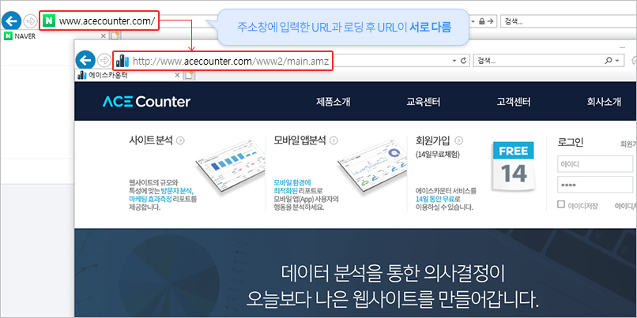
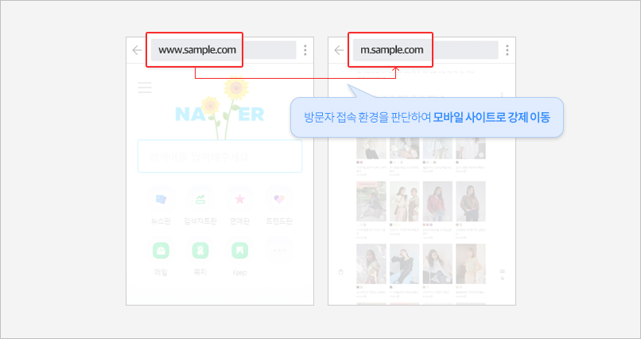
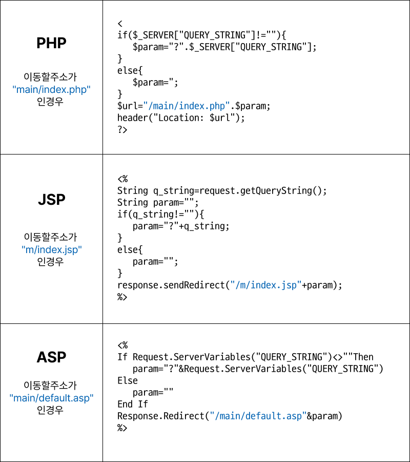
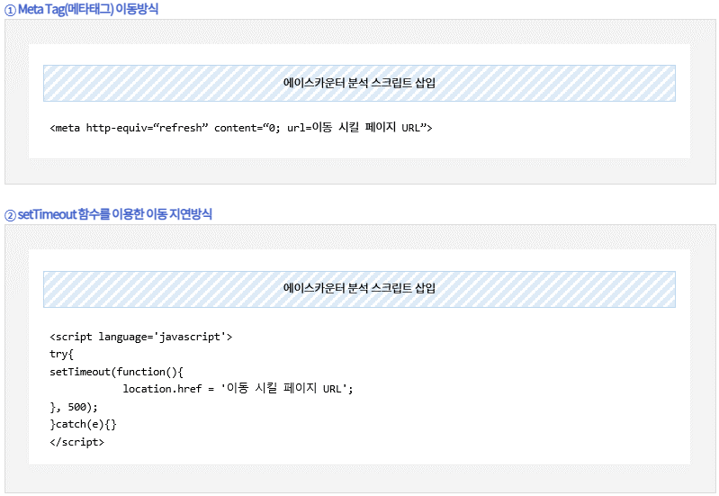

# 첫 페이지 강제 이동 사이트 설치

#### 이동 여부 확인 방법

페이지 강제 이동은 눈으로 확인하기 어려울 만큼 빠르게 일어납니다. 주소창에 사이트 주소를 직접 입력해 접속한 뒤 URL이 변경되는지 확인하면 이동 여부를 알 수 있습니다. (예: www.acecounter.com으로 접속했는데 www.acecounter.com/www2/main.amz로 표시된다면 이동된 것입니다.)

모바일 페이지로 이동하는 경우도 동일하게 확인할 수 있습니다.

#### 유입출처를 알 수 없는 이동 방식

첫 페이지에서 이동한다고 해서 반드시 유입출처가 유실되는 것은 아니지만, 자바스크립트 또는 HTML Tag를 사용해 이동하는 사이트는 방문자의 유입출처가 남지 않을 수 있습니다. 유입출처가 대부분 '직접유입'이나 '내부유입'으로 분석된다면 이 경우에 해당될 수 있습니다.

#### 권장하는 이동 방식 : **표준 HTTP 프로토콜 헤더 이용**


실제 홈페이지에 적용하기 전, 반드시 구동에 문제가 없는지 테스트한 후 이동 방식을 변경해 주세요.


빠른 속도로 이동하면서도 유입출처 분석이 가능한 방식입니다. 광고 분석이 가능하도록 파라미터(광고코드 또는 추적 URL)를 유지한 채 리다이렉션해야 합니다.

#### **권장 방식으로 변경이 어려운 경우**

Meta Tag 또는 setTimeout 함수를 이용해 이동하는 방법이 있습니다. 이동 구문보다 상단에 분석 스크립트를 추가로 설치해야 합니다.


이 방식은 유입출처 분석은 가능하지만, 이동 전/후 2개의 페이지가 분석되어 페이지붰(PV)가 실제보다 과집계되고 반송 분석이 어려워집니다. 에이스카운터는 페이지붰(PV) 구간에 따라 요금이 책정되므로 되도록 권장 방식(표준 HTTP 헤더)을 사용해 주세요.

