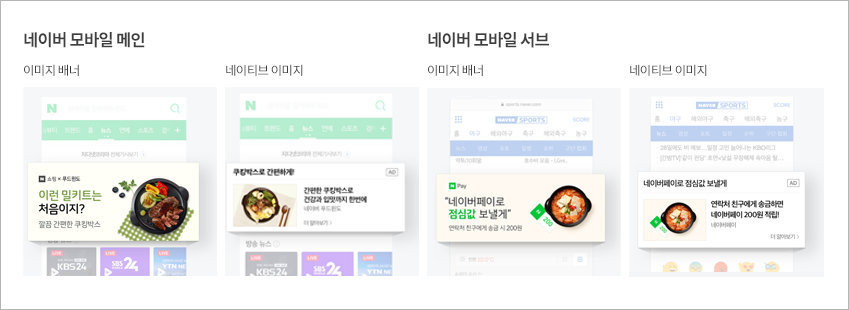
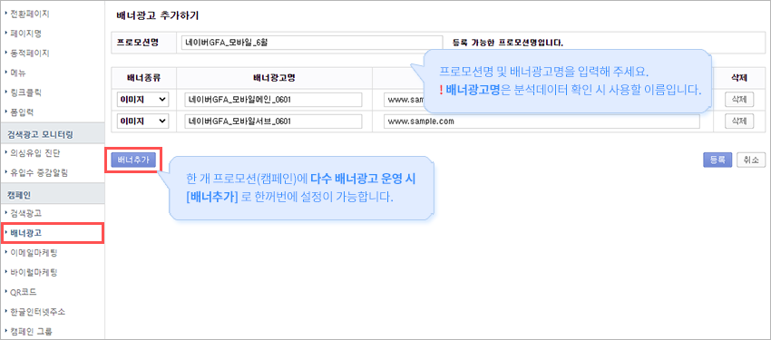
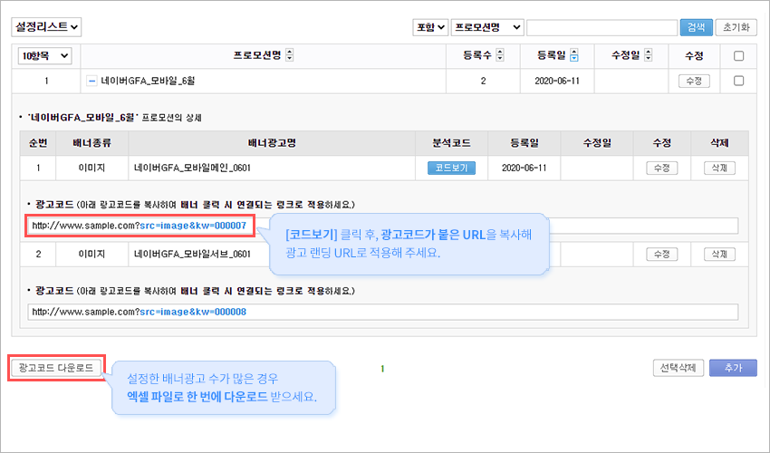
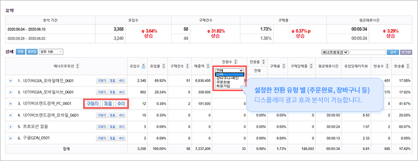
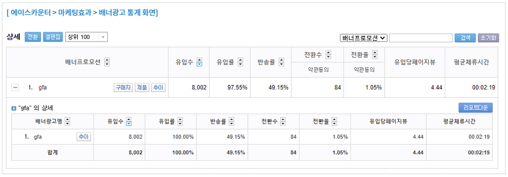
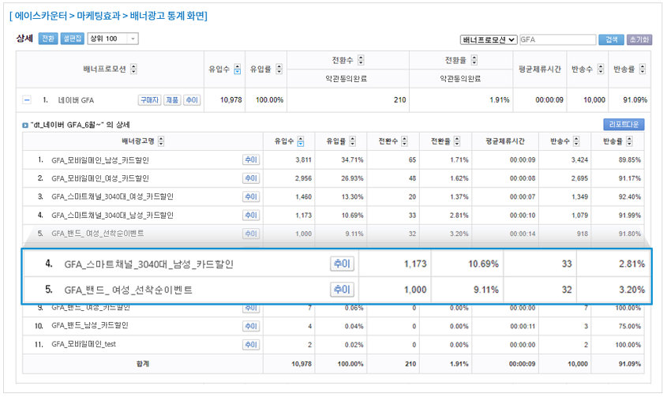
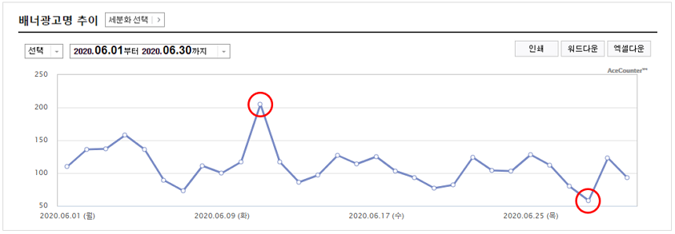

# 디스플레이 광고 분석 설정

디스플레이 광고는 웹사이트에서 배너 형태로 노출되는 광고로, 포털 사이트 메인화면이나 언론사 사이트에서 흔히 볼 수 있습니다. 잠재 고객에게 브랜드를 알리는 효과가 있어 마케터들이 주목하는 광고 상품입니다. 아래는 네이버 디스플레이 광고를 예시로 한 설정 방법입니다.

### 1. 배너광고 설정하기



#### 배너광고 메뉴 이동

로그인 후 \[통계보기 > 설정 > 캠페인 > 배너광고]로 이동합니다.



#### 배너광고 등록

\[추가] 버튼을 클릭한 뒤 분석하려는 배너광고 정보를 입력합니다.




#### 등록 확인 및 수정

등록된 배너광고 정보를 확인합니다. 수정이 필요하면 우측 \[수정] 버튼을 누르면 됩니다.




### 2. 배너광고 효과 데이터 확인하기

로그인 후 \[통계보기 > 분석통계 > 마케팅효과 > 배너광고]에서 확인할 수 있습니다.

* **구매자**: 해당 광고로 방문 후 구매한 구매내역과 구매자 정보
* **제품**: 해당 광고로 방문 후 구매된 제품별 상세 정보
* **추이**: 해당 광고의 일자별 유입수

### 3. 분석 사례

영역/타겟/소재를 구분해 배너광고 설정명을 세분화하면, 단순히 광고명으로만 구분했을 때보다 훨씬 정교한 분석이 가능합니다.

**▶ (A) 배너광고명으로만 세팅한 사이트**

**▶ (B) 광고 영역 / 타겟 / 소재를 배너광고 설정명에 적용한 사이트**

예를 들어 광고 영역·타겟·소재별로 설정명을 나누면 각 그룹의 CPA(Cost Per Action, 전환 1건당 비용)를 비교해 예산을 어느 그룹에 더 투입할지 데이터 기반으로 판단할 수 있습니다. '카드 혜택'에 반응하는 타겟, '선착순 이벤트'에 반응하는 타겟 등의 효율을 비교해 연령·성별·지역·관심사 기반의 소재 제작에도 데이터를 활용할 수 있습니다.


각 광고의 '추이' 버튼을 통해 유입/반송/전환 추이의 증감 이슈를 빠르게 파악하고 대처할 수 있습니다. 네이버 GFA뿐만 아니라 카카오, 구글 등 주요 디스플레이 광고도 노출 지면 설정 및 상세 타깃팅 분석이 가능합니다.


