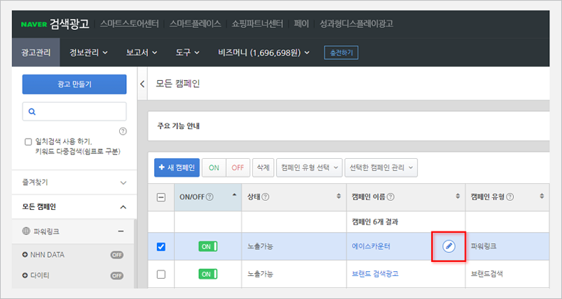
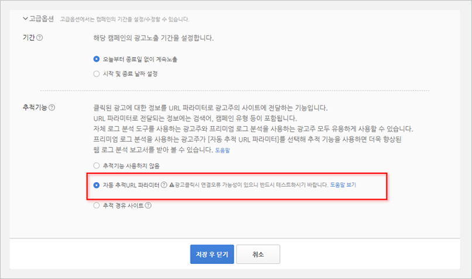
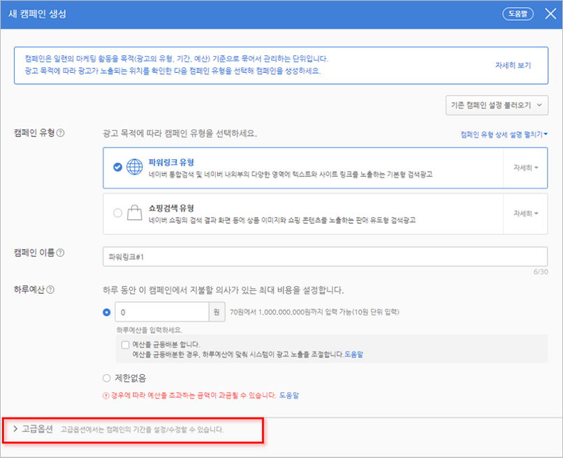
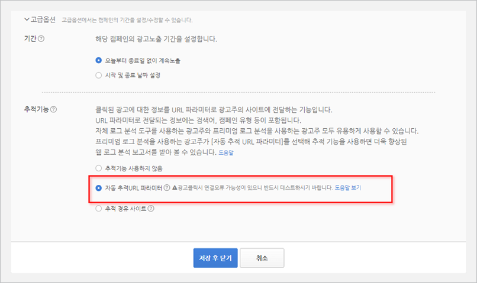
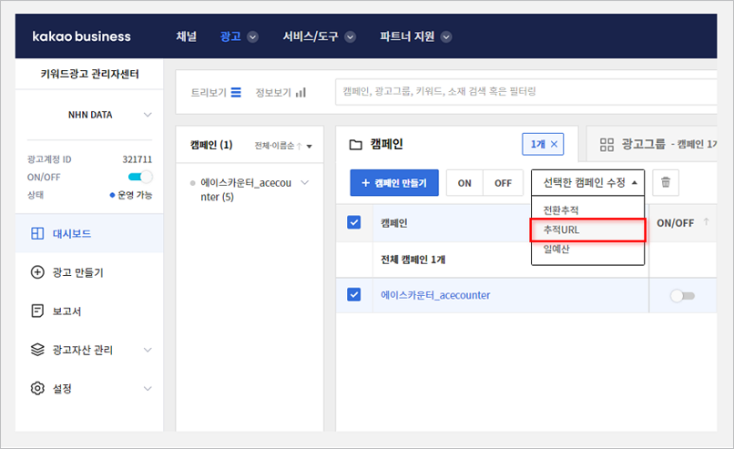
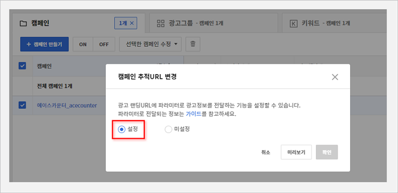
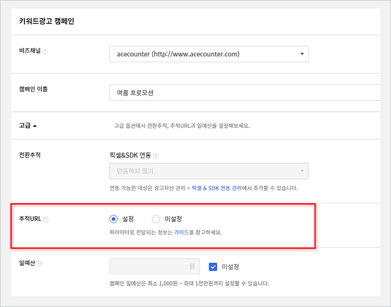

# 검색광고 분석 설정

간단한 설정만으로 국내 주요 검색광고 매체의 검색어를 자동으로 분석할 수 있습니다.

| 검색광고 상품       | 자동분석 여부          | 설정방                                                                                         |
| ------------- | ---------------- | ------------------------------------------------------------------------------------------- |
| 네이버 검색광고      | O                | [바로가기](https://acecounter.gitbook.io/guide/setting/search-ads-automation/naver-search-ads)  |
| 카카오 키워드광고     | O                | [바로가기](https://acecounter.gitbook.io/guide/setting/search-ads-automation/kakao-keyword-ads) |
| 구글 Ads 검색 캠페인 | O (검색어 추가 설정 필요) | [바로가기](https://acecounter.gitbook.io/guide/setting/search-ads-automation/google-ads)        |

### 1. 매체별 설정 방법



**기존 캠페인 수정**

1. 네이버 광고 시스템에 로그인합니다.
2. 모든 페인 화면에서 적용할 캠페인 우측의 연필 아이콘을 클릭합니다.
3. 고급 옵션의 추적 기능 항목에서 '자동 추적 URL 파라미터'를 선택하고 저장합니다.

**신규 캠페인에 적용**

1. 네이버 광고 시스템에 로그인합니다.
2. 새 캠페인 생성 시 하단의 '고급 옵션'을 클릭합니다.
3. 추적 기능 항목에서 '자동 추적 URL 파라미터'를 선택하고 저장합니다.




**기존 캠페인 수정**

1. 카카오 비즈니스에 로그인합니다.
2. \[대시보드 > 캠페인 선택 > 선택한 캠페인 수정 > 추적URL]에서 추적 URL을 클릭합니다.
3. 캠페인 추적 URL 변경 레이어 팝업에서 '설정'을 선택하고 확인 버튼을 누르면 완료됩니다.

**신규 캠페인에 적용**

1\. 카카오 비즈니스에 로그인합니다.

2\. 캠페인 생성 시 '고급'을 클릭하면 추적 URL 옵션이 보이며, '설정'으로 체크하면 간단히 적용됩니다.





계정 / 캠페인 / 광고 그룹 단위로 각각 설정할 수 있으며, 일반적으로는 '계정 단위'로 일괄 설정하는 것을 권장합니다.


**검색어 설정 방법 (계정 단위)**

1. 구글 애즈 로그인 후 \[설정 > 계정 설정 > 추적]을 클릭합니다.
2. 최종 도착 URL 접미사 영역에 아래와 같이 입력합니다.
   * 추적 템플릿: (비워둠)
   * 최종 도착 URL 접미사: `ACE_REF=adwords_{network}&ACE_KW={keyword}`
3. 테스트 버튼으로 정상 접속을 확인하고 저장합니다.

.png>)

**캠페인/광고 그룹 단위 설정**

* 캠페인: \[캠페인 선택 > 설정 > 추가 설정 > 캠페인 URL 옵션]
* 광고그룹: \[광고그룹 선택 > 설정 > 추가 설정 > 광고그룹 URL 옵션]

위 메뉴에서 계정 단위 설정과 동일한 최종 도착 URL 접미사(`ACE_REF=adwords_{network}&ACE_KW={keyword}`)를 입력합니다.


설정을 모두 완료해도, 동적 검색 광고(DSA) 유입, 실적 최대화(AI Max) 캠페인 유입, 구글 시스템의 일시적 오류 등의 이유로 `{keyword}` 값이 수집되지 않아 '검색어 없음'으로 표시될 수 있습니다.




### 2. 검색광고 주요 리포트

| 리포트                                                                                | 설명                                               |
| ---------------------------------------------------------------------------------- | ------------------------------------------------ |
| [**\[검색광고효과 > 검색광고 상품별\]**](https://www.acecounter.com/stat/view/statview4_2.amz)  | 검색광고 상품별로 비교 분석합니다. 2개 이상의 검색광고 상품을 운영할 때 유용합니다. |

| 리포트                                                                                | 설명                                                                         |
| ---------------------------------------------------------------------------------- | -------------------------------------------------------------------------- |
| [**\[검색광고효과 > 검색광고 검색어별\]**](https://www.acecounter.com/stat/view/statview4_3.amz) | 검색어별 유입, 반송, 구매(전환), 매출액, 유입당 페이지뷰, 체류시간 등을 분석해 효율이 높고 낮은 검색어를 파악할 수 있습니다. |

| 리포트                                                                                   | 설명                                                                                |
| ------------------------------------------------------------------------------------- | --------------------------------------------------------------------------------- |
| [**\[검색광고효과 > 검색광고 시간대별 평균\]**](https://www.acecounter.com/stat/view/statview4_7.amz) | 요일별·시간대별 평균 유입수와 전환수를 분석합니다. 광고 유입이 높은 요일·시간대에 집중적으로 광고를 진행하거나 이벤트를 기획해 볼 수 있습니다. |

