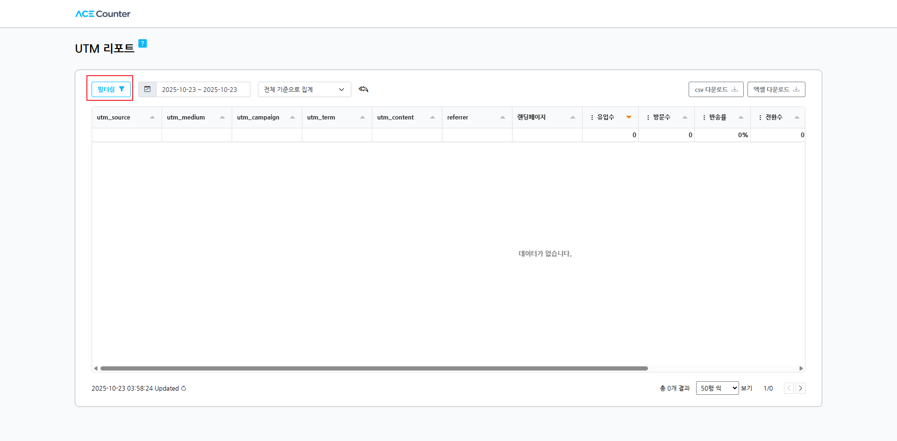
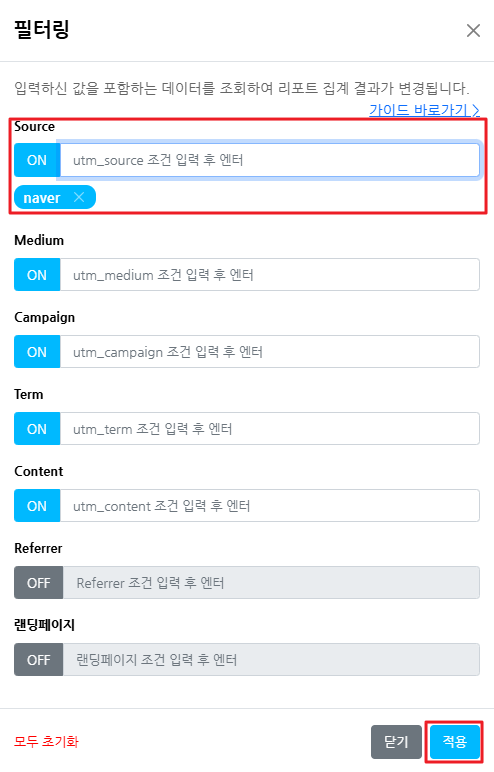
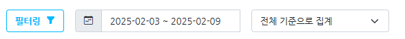

# UTM 리포트 활용

### 1. UTM 코드 조회

리포트 좌측 상단의 \[필터링] 버튼을 클릭하면 필터링 레이어가 노출되며, 측정 기준으로 원하는 데이터를 조회할 수 있습니다.

**1) 측정 기준 ON/OFF**

기본(디폴트) 리포트는 `utm_source`, `utm_medium`, `utm_campaign`, `utm_term`, `utm_content` 5가지 UTM 측정 기준과 `Referrer`, `랜딩페이지`까지 모두 ON 상태입니다. 왜쪽의 ON/OFF 버튼으로 원하는 기준으로만 데이터를 구분하고 집계할 수 있습니다.

**2) 측정 기준 조건 추가**

측정 기준마다 특정 텍스트를 포함하는 조건으로 데이터를 조회할 수 있습니다. 예를 들어 `utm_source`에 `naver`가 포함된 데이터만 보고 싶다면 해당 입력박스에 `naver`를 입력하고 \[적용]을 누르면 됩니다. 여러 값을 입력하면 OR 조건으로 적용됩니다. (값을 입력하지 않은 ON 상태의 기준은 전체 데이터를 기준으로 조회합니다.)

**3) 모두 초기화**

좌쪽 하단의 모두 초기화 버튼을 클릭하면 기본(디폴트) 리포트 상태로 되돌아갑니다. 초기화 시 이전 설정값은 되돌릴 수 없으니 유의해 주세요.

### 2. 주요 측정 기준

| 이름                                                                   | 설명                                                                                                  |
| -------------------------------------------------------------------- | --------------------------------------------------------------------------------------------------- |
| utm\_source / utm\_medium / utm\_campaign / utm\_term / utm\_content | URL에 붙은 각 UTM 파라미터의 값입니다. 구글 Ads 자동 태깅 사용 시 utm\_term/utm\_content에 id(숫자)가 들어갈 수 있습니다.             |
| referrer                                                             | URL로 이동하기 전 브라우저가 알고 있는 이전 페이지 정보입니다. 정보가 없다면 주소창 직접 입력 또는 북마크 이동입니다.                               |
| 랜딩 페이지                                                               | URL로 이동하여 도착한 페이지의 디렉토리(path)입니다.                                                                   |
| 날짜                                                                   | 전체/시간/일간/월간/주간/일시 기준으로 데이터 집계 방식을 변경할 수 있습니다. 시간은 00\~23시 24개 기준, 일시는 여기에 날짜 기준까지 더해진 보다 세분된 기준입니다. |

### 3. 주요 측정 항목

| 이름         | 설명                                                                          |
| ---------- | --------------------------------------------------------------------------- |
| 유입수        | 웹사이트에 처음 들어온 횟수로, 하나의 세션에서 최초 방문(랜딩 페이지)에 기록됩니다.                            |
| 방문수        | 사용자가 웹사이트를 방문한 총 횟수입니다. 보통 세션(약 30분) 단위로 측정되며, 세션이 끝난 후 다시 방문하면 방문수가 증가합니다. |
| 반송수 / 반송률  | 하나의 페이지만 보고 추가 상호작용 없이 이탈한 횟수이며, 반송률 = 반송수 / 유입수 x 100(%)입니다.               |
| 전환수 / 전환률  | 전환페이지 설정이 완료되어야 측정되며, 전환률 = 전환수 / 유입수 x 100(%)입니다.                          |
| 구매건수 / 구매율 | 사용자가 구매를 완료한 횟수이며, 구매율 = 구매수 / 유입수 x 100(%)입니다.                             |
| 체류시간       | 사용자가 웹사이트에 머물러 부분변촵량입니다. 측정 기준별 평균값이 표시됩니다.                                 |
| 매출액        | 집계된 구매 건의 총 매출입니다.                                                          |

### 4.  데이터 인정 기준


아래 2가지를 모두 만족한 경우에만 UTM 리포트와 유입리포트에서 UTM 항목으로 표시됩니다.


**1) UTM으로 인정되려면** 수집된 URL에 필수 utm 값인 `utm_source`, `utm_medium`, `utm_campaign` 3개 항목이 모두 포함되고 값이 있어야 합니다. 하나라도 빠지거나 값이 없으면 UTM으로 인정되지 않습니다.

**2) 유입데이터 우선순위**: UTM으로 인정되어도 분석 우선순위에 따라 다른 유입으로 집계될 수 있습니다.

1. 에이스카운터 설정 코드(광고코드, 배너코드 등)가 URL에 포함된 경우
2. 네이버/카카오/구글 등 주요 매체의 자동추적 설정이 켜져 있는 경우
3. UTM 파라미터 정보가 포함된 경우

예를 들어 URL에 에이스카운터 배너 광고 코드(`&src=image&kw=120024`)가 포함되어 있다면, UTM 파라미터가 있더라도 배너광고 유입으로 우선 집계되어 UTM으로는 표시되지 않습니다.
