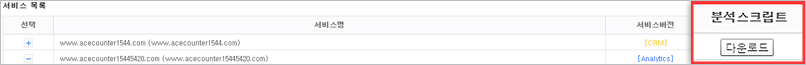
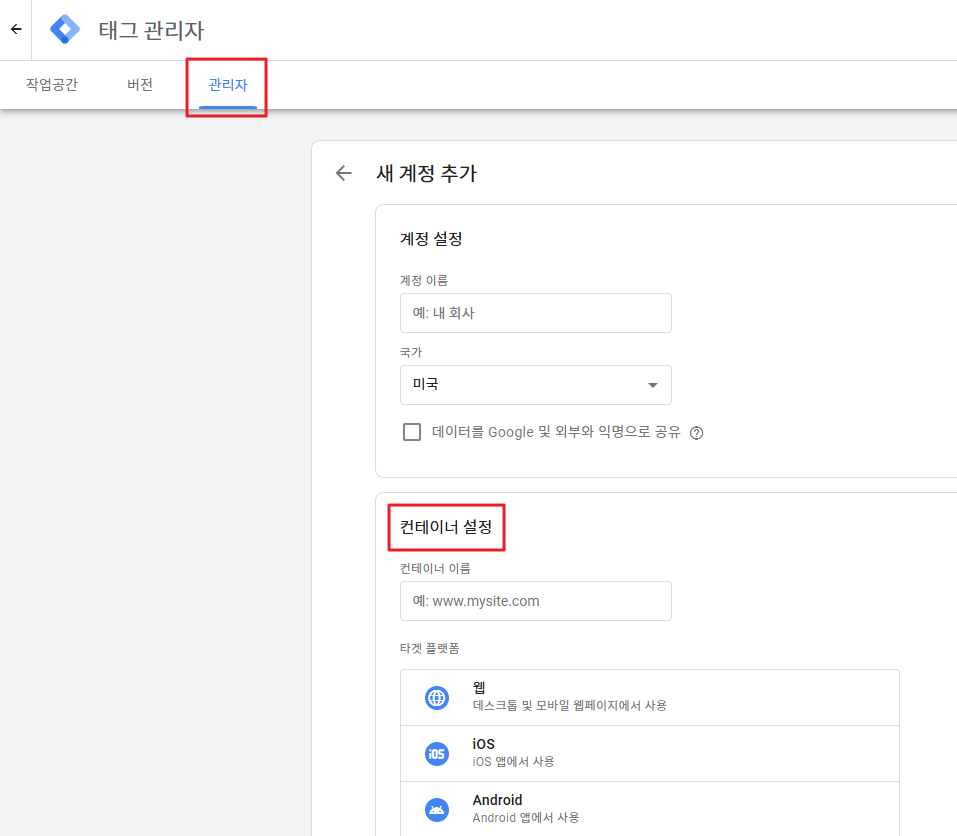
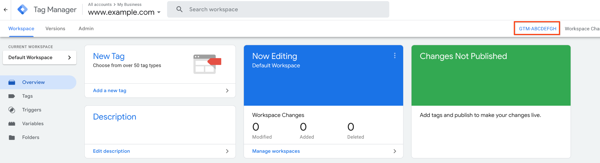
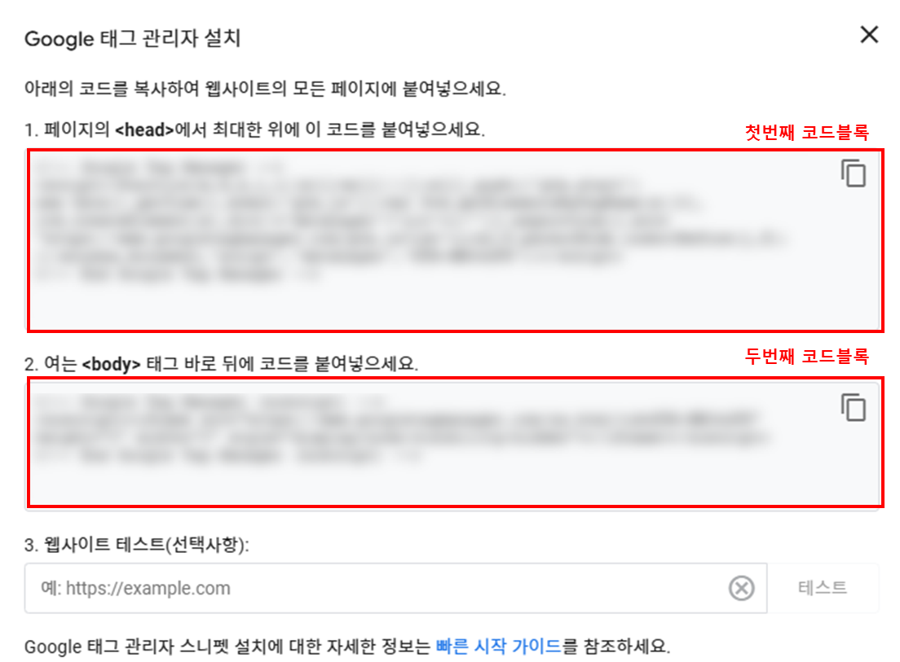
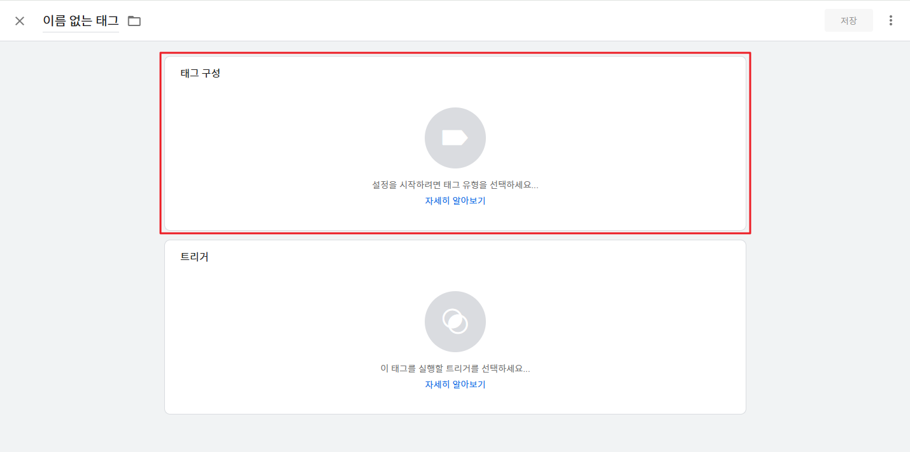
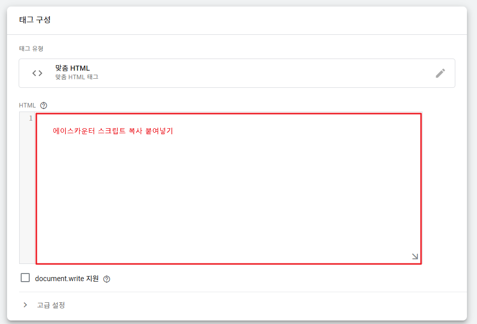
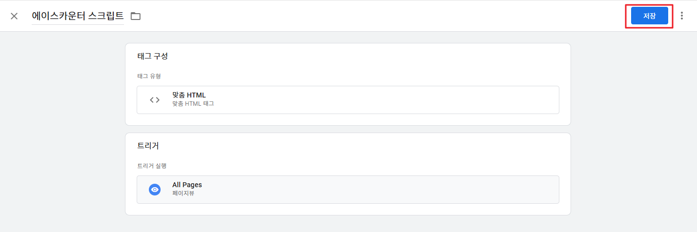
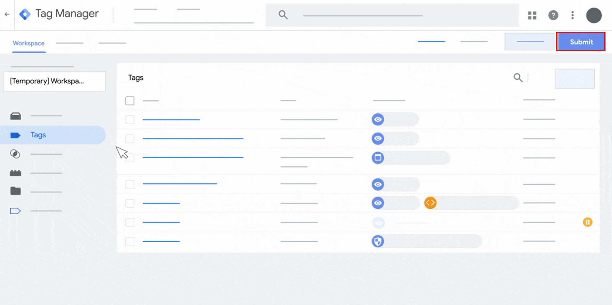

# UTM 스크립트 연동 가이드

UTM 분석을 사용하려면 사이트에 에이스카운터 분석 스크립트가 설치되어 있어야 합니다. 상황에 맞는 방법을 선택해 진행해 주세요.



사이트에 에이스카운터 스크립트를 직접 설치하여 UTM 분석을 시작합니다.

**1. 무료 설치 지원**

스크립트 설치가 어렵다면 에이스카운터 전문 개발자를 통한 설치 대행 서비스(최초 1회 무료)를 이용할 수 있습니다. 소스를 수정할 수 있는 FTP 정보(주소, PORT, ID, PW) 전달이 필요합니다.

**2. 스크립트 직접 설치**


[basic-script.md](../../setup/script-install/basic-script.md)




기존에 Google Analytics를 사용하고 계셨다면 Google Tag Manager(GTM)를 통해서도 에이스카운터 스크립트를 손쉽게 적용할 수 있습니다. GTM "관리자" 권한의 구글 계정이 필요합니다.

**1단계. 에이스카운터 회원가입**

홈페이지에서 '무료체험 시작하기' 버튼을 클릭해 가입을 완료합니다. 이미 사용 중이라면 '스크립트를 설치하여 시작하기' 탭을 참고하세요.

**2단계. 분석스크립트 확인**

\[서비스 관리 > 분석 스크립트 > 다운로드·직접설치] 메뉴에서 공통 스크립트를 화면에서 바로 복사하거나 다운로드해 준비합니다.

압축 해제 후 공통 스크립트에 해당하는 txt 파일을 열어주세요.

**3단계. Google Tag Manager 설정**

GTM 설정이 처음이라면 계정과 컨테이너를 생성한 후, 발급된 컨테이너 코드를 사이트의 `<head>`와 `<body>` 직후에 각각 삽입합니다. 이미 GTM 컨테이너가 설치되어 있다면 이 단계는 생략합니다.

**4단계. 태그 생성**

\[태그 > 새로 만들기]에서 맞춤 HTML 태그를 생성하고, HTML 입력란에 2단계에서 준비한 공통 스크립트를 붙여넣습니다. 트리거는 이름 `All pages`, 유형 `페이지붰`로 설정합니다.

**5단계. 제출하기**

설정을 완료한 후 우측 상단의 제출 버튼을 클릭하고, 게시 버튼을 누르면 설정이 완료됩니다.




**UTM 리포트 제공 대상**

Business, Commerce 버전 서비스(사이트)에서 UTM 리포트를 사용하실 수 있습니다. 해당 버전이 아니거나 어떤 버전인지 모르시는 경우 고객지원으로 문의해 주세요.

**UTM 사용 방법**

1. **스크립트 재설치**: 기존 고객님은 UTM 사용을 위해 스크립트 재설치가 필요합니다. "스크립트로 시작하기" 탭의 설치 방법을 동일하게 따라 진행하세요.
2. **UTM 사용 신청**: 재설치를 완료한 후 채널톡으로 'UTM 신청' 또는 'UTM을 사용하고 싶어요' 등으로 자유롭게 문의를 남겨주시면 담당자가 빠르게 안내해 드립니다.


